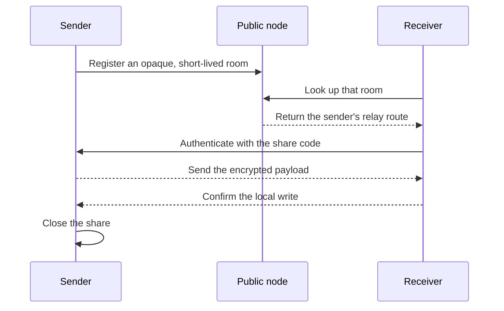

Envshare is a live handoff, not an upload service.

## What the public node does

The built-in node at `node.envshare.xyz` helps the two peers find each other and
relays encrypted traffic when they cannot connect directly. It can observe
network metadata such as IP addresses, timing, and traffic volume.

The node should not receive the share code, encryption keys, environment names,
values, or plaintext payload.

## What the share code does

The code is both an address and a bearer credential. It lets the receiver find
the right sender and prove that it is allowed to claim the payload. Possession
is authorization; there is no account check behind it.

## Why the sender stays open

Envshare has no offline mailbox. The payload lives with the sender until one of
these things happens:

- one valid receiver claims it;
- the share expires;
- the sender cancels it; or
- the transfer fails.

This keeps the service simple and avoids a hosted payload database, but it also
means both computers must be online at the same time.

<Card title="Read the security boundary" icon="shield-check" href="/security">
See what is encrypted, what metadata remains visible, and how to handle a leaked code.
</Card>
