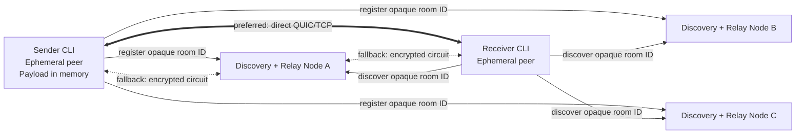
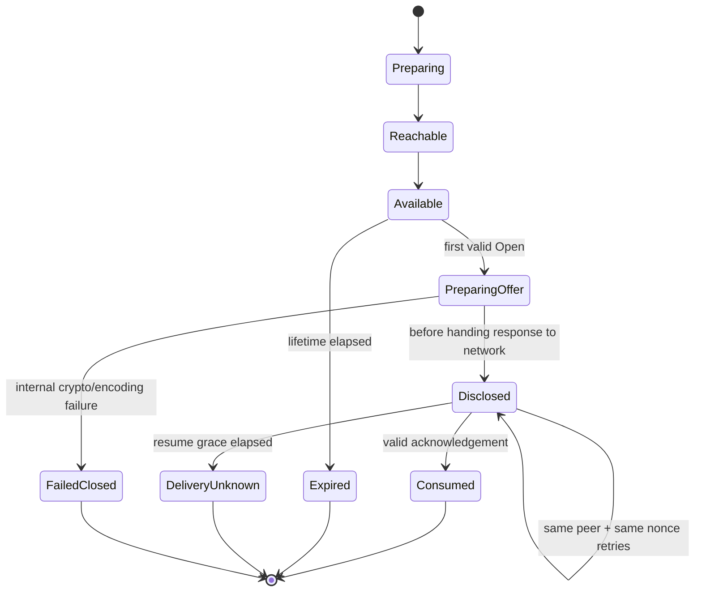

# Envshare: Production Architecture and End-to-End Implementation Guide

> **Status:** implementation architecture for the one-time, sender-online release  
> **Primary language:** Rust  
> **Networking:** libp2p  
> **Protocol version proposed here:** `/envshare/transfer/1.0.0`  
> **Source/API verification date:** 2026-08-15

This document specifies a production-grade implementation of an open-source, accountless service for transferring a `.env` file or selected environment variables from one online machine to a single receiver claim.

The data plane is peer-to-peer where possible and end-to-end encrypted when relayed. Public infrastructure is limited to untrusted discovery and circuit-relay nodes. No relay, discovery node, database, or hosted API persistently stores the environment payload.

The working product name in this document is `envshare`. Treat it as a placeholder.

## Contents

- [Product scope and architecture](#1-executive-decision)
- [Trust model](#5-trust-boundaries-and-threat-model)
- [One-time delivery semantics](#6-correct-one-time-semantics)
- [Capability and cryptography](#7-capability-code-and-key-derivation)
- [Wire protocol](#9-wire-protocol-and-framing)
- [Libp2p networking](#10-libp2p-networking-design)
- [Rust workspace and packages](#12-rust-workspace)
- [Client and CLI implementation](#14-core-implementation-details)
- [Production node](#16-production-discovery-and-relay-node)
- [VPS, Docker, and systemd deployment](#18-vps-deployment-architecture)
- [CI, testing, and failure behavior](#23-ci-pipeline)
- [Implementation phases and acceptance criteria](#27-end-to-end-implementation-plan)

---

## 1. Executive decision

Build the first release as a **one-time capability-based handoff**:

1. The sender runs `envshare send .env`.
2. The CLI prepares the share in memory and starts a libp2p peer.
3. It reserves relay paths and registers an opaque room identifier with several Rendezvous nodes.
4. It prints a high-entropy one-time code.
5. The receiver runs `envshare receive`, pastes the code into a hidden prompt, discovers the sender, authenticates possession of the code, and downloads the encrypted payload.
6. The sender permits one receiver claim only.
7. The receiver writes the file atomically or injects the variables into a child process.
8. The receiver sends an authenticated acknowledgement.
9. Both peers wipe owned secret buffers where practical and exit.

The sender must remain online. There is no offline mailbox, object storage, IPFS payload, blockchain, user account, team vault, or persistent secret database in this release.

### 1.1 Architecture in one sentence

> P2P transfer, federated discovery, untrusted relay fallback, application-level code authentication, and sender-enforced single-claim semantics.

### 1.2 Why this shape

It gives the product its strongest useful properties without turning the first release into a full secrets manager:

- Accountless and fast.
- No hosted secret storage.
- Self-hostable infrastructure.
- Good NAT reliability through Circuit Relay v2.
- No dependency on a DHT converging before a short-lived transfer.
- A small protocol that can be audited.
- A clean path to future clients in Go, TypeScript, Swift, or Kotlin.

### 1.3 What “decentralized” means here

The design has two planes:

| Plane | Design | Trust requirement |
|---|---|---|
| Data plane | Direct libp2p connection or libp2p circuit relay | Relay is not trusted with plaintext |
| Discovery plane | Several independent Rendezvous nodes queried in parallel | Nodes may censor or lie, but cannot authenticate or decrypt a share |

Rendezvous is federated, not a fully decentralized DHT. This is deliberate for v1. Users can replace the built-in nodes with their own network configuration.

---

## 2. Scope

### 2.1 Required v1 capabilities

- Send a raw `.env` file.
- Send data read from stdin.
- Send a selected subset of environment keys.
- Receive into a new file.
- Run a command with received variables without writing a file.
- Discover the sender from a one-time code.
- Connect directly where possible.
- Fall back to a relay without exposing plaintext to that relay.
- Enforce one receiver claim.
- Expire unused shares.
- Self-host combined Rendezvous and relay nodes on a VPS.
- Use multiple independent public nodes for availability.
- Provide machine-readable CLI output without accidentally logging values.
- Expose health, metrics, and structured logs on the node.
- Publish the protocol, test vectors, and threat model.

### 2.2 Explicit non-goals

Do not implement these in the first release:

- Persistent project environments.
- User accounts, organizations, roles, or invitations.
- Secret version history.
- Offline retrieval after the sender exits.
- Encrypted payload storage on discovery nodes, relays, IPFS, or object stores.
- A web dashboard.
- Browser-to-browser transfer.
- Low-entropy word codes.
- Password-authenticated key exchange.
- Kademlia-based discovery as the default.
- End-user anonymity.
- Receiver revocation after disclosure.
- Guaranteed physical erasure from RAM, swap, terminals, filesystems, or child processes.

### 2.3 Recommended defaults

| Setting | Default | Hard limit or policy |
|---|---:|---:|
| Share lifetime | 10 minutes | Configurable from 1 to 30 minutes |
| Payload size | Up to 1 MiB | Reject before allocation above the hard limit |
| Successful claims | 1 | Not configurable in v1 |
| Receiver identity | Ephemeral per command | Persist only for the lifetime of the command |
| Sender identity | Ephemeral per share | Never reused |
| Discovery nodes | 3 | At least 1 must succeed before code display |
| Relay reservations | Up to 3 | At least 1 required on the public network |
| Direct-connect grace | 750 ms | Then race relay without waiting for hole punching |
| Transfer request timeout | 20 seconds | Bounded and configurable internally |
| Same-claim resume grace | 60 seconds | Same receiver and nonce only |
| Output overwrite | Refused | Require explicit `--force` |
| Unix file mode | `0600` | Set before writing data |
| Compression | Disabled | Keep disabled for v1 |

---

## 3. User experience

### 3.1 Send

```console
$ envshare send .env

Preparing 18 variables · 2.4 KiB
Establishing secure reachability... done

Share code:
esh1-6D7M-2Q9K-X4VN-8JCT-H3PR-W5BZ-0FGA-K8TY-91

Expires in 10 minutes · One receiver only
Waiting for receiver...

Receiver authenticated.
Transfer acknowledged. Share consumed.
```

Do not display values. Print operational status to stderr. The code may be printed to stdout in a dedicated automation mode.

### 3.2 Receive

```console
$ envshare receive --output .env.local
Enter share code: •••••••••••••••••••••••••••••••••••••••

Locating sender... done
Receiving 2.4 KiB... done
Written atomically to .env.local with private permissions.
```

The default interactive output path should be `.env.shared`, not `.env`, to avoid accidental replacement of a project’s existing file. Refuse to overwrite unless `--force` is supplied.

### 3.3 Run without a file

```console
$ envshare run -- pnpm dev
Enter share code: •••••••••••••••••••••••••••••••••••••••

Launching `pnpm dev` with 18 received variables.
No environment file was written.
```

Spawn the program directly with `std::process::Command` or `tokio::process::Command`. Never pass the command through a shell.

### 3.4 Automation-safe forms

```console
# Sender: print only the capability to stdout; status remains on stderr.
envshare send .env --code-only

# Receiver: avoid command-line history.
printf '%s\n' "$ENVSHARE_CODE" | envshare receive --code-stdin -o .env.local

# Read the payload from stdin.
cat .env.production | envshare send -

# Select keys. This parses and reserializes a normalized dotenv payload.
envshare send .env --keys DATABASE_URL,REDIS_URL,STRIPE_SECRET_KEY

# Check public-node, direct, QUIC, TCP, and relay reachability.
envshare doctor
```

Document that `--code <value>` is less safe because process arguments and shell history may expose the capability. Support it only for environments that accept that trade-off.

---

## 4. System architecture



### 4.1 Components

#### `envshare`

One cross-platform Rust CLI containing:

- Sender command.
- Receiver command.
- No-file `run` command.
- Network diagnostics.
- Configuration management.
- Protocol, crypto, discovery, and network libraries.

#### `envshare-node`

One deployable Rust daemon containing:

- Stable libp2p node identity.
- TCP and QUIC listeners.
- Circuit Relay v2 server behaviour.
- Rendezvous server behaviour.
- Identify and Ping.
- Connection and memory limits.
- Application-level admission control.
- HTTP health and OpenMetrics endpoint bound to loopback or a private monitoring interface.

The combined node is appropriate for v1. Split discovery and relay into separate processes only when load or failure-domain requirements justify it.

#### Public network configuration

The CLI ships with a small list of independent nodes, each identified by a DNS multiaddress containing its stable Peer ID. Users can define another network in local configuration.

No load balancer is required. Clients connect to all configured nodes independently.

### 4.2 No database

Neither client nor node needs a database.

- The sender owns ephemeral share state in memory.
- Rendezvous registrations are short-lived and in memory.
- Relay reservations and circuits are ephemeral.
- A node restart drops registrations and circuits.
- The sender periodically re-registers with remaining nodes.
- The payload is never persisted by infrastructure.

The only persistent node data is its libp2p identity key and configuration.

---

## 5. Trust boundaries and threat model

### 5.1 Assets

- Raw environment payload.
- One-time capability code.
- Keys derived from the capability.
- Sender and receiver process environments.
- Node identity keys.

### 5.2 Adversaries considered

- Passive network observer.
- Malicious or compromised relay node.
- Malicious or compromised discovery node.
- Internet peer sending malformed or oversized frames.
- Peer attempting to claim a share without the code.
- Two valid receivers racing with the same leaked code.
- Sybil peers exhausting discovery registrations or relay reservations.
- Local accidental leakage through logs, shell history, file permissions, or process arguments.

### 5.3 Security properties

The implementation must provide:

- Transport confidentiality and authentication through libp2p QUIC or Noise.
- Application-level proof that both peers know the capability.
- Binding of the handshake to both libp2p Peer IDs.
- Application-layer AEAD encryption of the environment payload.
- Replay-resistant nonces and claim identifiers.
- One receiver claim at the sender.
- Strict message, allocation, connection, registration, and relay limits.
- No secret values in logs, metrics, error strings, panic context, or tracing fields.
- Atomic receiver output with private permissions.

### 5.4 Properties not provided

- Anonymity. Nodes can observe IP addresses, Peer IDs, timing, and byte counts.
- Protection from a compromised endpoint.
- Protection after an authorized receiver copies the values.
- Guaranteed RAM erasure.
- Availability against a sufficiently large DDoS attack.
- Global prevention of a leaked code being used first by an attacker.

The code is a bearer capability. Anyone who obtains it is authorized from the protocol’s perspective.

---

## 6. Correct one-time semantics

A production implementation must not define one-time as “delete only after acknowledgement.” That permits a dangerous failure mode:

1. Receiver A receives the payload.
2. Receiver A’s acknowledgement is lost.
3. Sender incorrectly marks the share available again.
4. Receiver B receives the same payload.

Instead, use **single-claim, fail-closed semantics**.

### 6.1 Sender state machine



### 6.2 Rules

- The first valid `Open` atomically binds the share to:
  - receiver Peer ID;
  - receiver nonce;
  - generated claim ID.
- A different receiver is rejected after the claim.
- The sender transitions to `Disclosed` **before** calling the network API that may send ciphertext.
- Once `Disclosed`, the share never returns to `Available`.
- The sender caches the exact encrypted offer.
- The same receiver, using the same Peer ID and nonce, may receive the identical cached offer again during the resume grace period.
- Re-sending an identical ciphertext and nonce under the identical key is acceptable; do not re-encrypt a different plaintext under that nonce.
- A valid acknowledgement transitions the share to `Consumed`.
- If no acknowledgement arrives, finish as `DeliveryUnknown`, not `Available`.
- The sender CLI tells the user to create a new share if delivery status is unknown.

### 6.3 Race handling

The libp2p `Swarm` and share state are owned by one event-loop task. This serializes inbound `Open` events and prevents a mutex race between two receivers. The first valid request wins. All later requests from a different claim are rejected.

### 6.4 Restart behaviour

The sender does not persist share state. If it exits or crashes, the share is lost. This is desirable for v1 and avoids persisting plaintext or capability material.

---

## 7. Capability code and key derivation

### 7.1 Code requirements

Use a high-entropy copy-and-paste code, not a six-digit PIN or a few dictionary words.

Generate 20 random bytes from the operating-system CSPRNG:

```text
code_secret = 160 random bits
```

Encode them using a case-insensitive Crockford Base32 alphabet. Add:

- Prefix: `esh1`.
- Grouping separators for readability.
- A short checksum for typo detection.

Example shape:

```text
esh1-6D7M-2Q9K-X4VN-8JCT-H3PR-W5BZ-0FGA-K8TY-91
```

The exact example is illustrative; define and publish a single canonical encoding in `protocol/code-format.md`.

The checksum is not a security mechanism. A suitable implementation is the first 10 bits of:

```text
SHA-256("envshare/code-checksum/v1" || code_secret)
```

Append those 10 bits as two Base32 symbols.

### 7.2 Parser rules

The parser must:

- Accept upper- or lower-case symbols.
- Ignore ASCII hyphens.
- Optionally map Crockford aliases such as `O` to `0` and `I`/`L` to `1`.
- Reject all other characters.
- Require the exact prefix and version.
- Require the exact decoded length.
- Verify the checksum before starting network activity.
- Return one generic invalid-code error without echoing the supplied value.

Use a locally defined encoder/decoder over a reviewed generic encoding crate such as `data-encoding`; do not add an obscure security-critical crate merely for this small format.

### 7.3 Network separation

Every configured discovery network has a stable, non-secret network identifier, for example:

```text
public-v1
acme-internal-v1
```

The network identifier is included in key derivation and all authentication transcripts. A code entered on the wrong network simply discovers no sender.

### 7.4 HKDF derivation

Use HKDF-SHA-256 with explicit domain separation.

Conceptually:

```text
root_prk = HKDF-Extract(
  salt = SHA-256("envshare/root-salt/v1"),
  ikm  = code_secret
)

room_id = HKDF-Expand(
  root_prk,
  "envshare/room-id/v1" || len(network_id) || network_id,
  16 bytes
)

auth_key = HKDF-Expand(
  root_prk,
  "envshare/auth-key/v1" || len(network_id) || network_id,
  32 bytes
)

session_base_key = HKDF-Expand(
  root_prk,
  "envshare/session-base-key/v1" || len(network_id) || network_id,
  32 bytes
)
```

Never reuse one derived key for a different purpose.

### 7.5 Discovery namespace

Only an encoded room identifier is sent to Rendezvous nodes:

```text
envshare/1/<network-id>/<base32(room_id)>
```

The node does not receive `code_secret`, `auth_key`, or `session_base_key`.

A 128-bit room identifier is enough to prevent practical namespace guessing. The underlying code still has 160 bits of entropy.

### 7.6 Secret types

Do not represent capability material as ordinary `String` values throughout the codebase.

Create narrow types:

```rust
pub struct ShareCodeSecret(SecretBox<[u8; 20]>);
pub struct AuthenticationKey(SecretBox<[u8; 32]>);
pub struct SessionBaseKey(SecretBox<[u8; 32]>);
pub struct RoomId([u8; 16]);
```

Requirements:

- No `Clone` unless genuinely required.
- No derived `Debug` for secret-bearing types.
- `Display` only for the intentionally encoded share code.
- `Zeroize` on owned key buffers.
- Constant-time comparison for authentication tags.
- Secret access confined to the crypto crate.

`zeroize` reduces exposure but cannot guarantee erasure of compiler-generated copies, terminal scrollback, swap, kernel buffers, or child-process environments. Document that limitation precisely.

---

## 8. Cryptographic protocol

Libp2p already authenticates and encrypts the transport. Envshare still performs an application handshake because transport identity alone does not prove possession of the share code, and a discovery node can return an arbitrary Peer ID or address.

### 8.1 Algorithms

| Purpose | Algorithm |
|---|---|
| Randomness | Operating-system CSPRNG |
| Key derivation | HKDF-SHA-256 |
| Proofs | HMAC-SHA-256 |
| Payload encryption | XChaCha20-Poly1305 |
| Payload and ciphertext digest | SHA-256 |
| Constant-time equality | `subtle` |
| Transport | libp2p QUIC or TCP + Noise + Yamux |

Do not invent a cipher or manually compose encryption and authentication.

### 8.2 Peer identities

- Sender generates a new Ed25519 libp2p identity for every `send` command.
- Receiver generates a new Ed25519 libp2p identity for every `receive` or `run` command.
- The receiver keeps the same identity across retries within that command.
- Public nodes use stable, persisted Ed25519 identities.

Binding proofs to ephemeral Peer IDs prevents a captured handshake from being replayed through another libp2p identity.

### 8.3 Canonical transcript

Do not HMAC arbitrary CBOR bytes. Equivalent CBOR data may have multiple encodings.

Create a tiny canonical transcript builder with:

- A domain-separation string first.
- Fixed big-endian integer encoding.
- A four-byte length before every byte string.
- Fixed field order.
- Exact Peer ID byte representation.
- No maps or optional fields inside security-critical transcripts.

Example interface:

```rust
pub struct Transcript {
    bytes: Vec<u8>,
}

impl Transcript {
    pub fn new(domain: &'static [u8]) -> Result<Self, TranscriptError>;
    pub fn append_u16(&mut self, value: u16);
    pub fn append_u64(&mut self, value: u64);
    pub fn append_bytes(&mut self, value: &[u8]) -> Result<(), TranscriptError>;
    pub fn finish(self) -> Vec<u8>;
}
```

Set a small maximum transcript length and return typed errors rather than panicking.

### 8.4 Open request

The receiver knows these values after discovery and connection establishment:

- Network ID.
- Room ID.
- Sender Peer ID.
- Receiver Peer ID.
- Fresh 32-byte receiver nonce.

It sends:

```rust
pub struct OpenRequest {
    pub protocol_version: u16,
    pub room_id: [u8; 16],
    pub receiver_nonce: [u8; 32],
    pub receiver_proof: [u8; 32],
}
```

Compute the receiver proof as:

```text
receiver_proof = HMAC-SHA-256(
  auth_key,
  transcript(
    "envshare/open/v1",
    protocol_version,
    network_id,
    room_id,
    sender_peer_id,
    receiver_peer_id,
    receiver_nonce
  )
)
```

The sender obtains the authenticated remote Peer ID from the libp2p connection. Never trust a Peer ID supplied only inside the application message.

### 8.5 Claim creation

After verifying the proof and checking state, the sender:

1. Atomically claims the share for this receiver Peer ID and nonce.
2. Generates a 32-byte sender nonce.
3. Generates a 16-byte claim ID.
4. Derives the session keys.
5. Serializes and encrypts the payload.
6. Caches the exact offer bytes.
7. Transitions to `Disclosed` before giving the offer to the network layer.

### 8.6 Session keys

Conceptually:

```text
session_prk = HKDF-Extract(
  salt = SHA-256(
    "envshare/session-salt/v1"
    || receiver_nonce
    || sender_nonce
  ),
  ikm = session_base_key
)

payload_key = HKDF-Expand(
  session_prk,
  transcript(
    "envshare/payload-key/v1",
    network_id,
    room_id,
    sender_peer_id,
    receiver_peer_id,
    claim_id
  ),
  32 bytes
)

ack_key = HKDF-Expand(
  session_prk,
  transcript(
    "envshare/ack-key/v1",
    network_id,
    room_id,
    sender_peer_id,
    receiver_peer_id,
    claim_id
  ),
  32 bytes
)
```

### 8.7 Payload envelope

Raw dotenv bytes are the default payload because they preserve comments, ordering, quoting, multiline values, empty values, and tool-specific syntax.

```rust
pub struct SecretEnvelope {
    pub format_version: u16,
    pub content_type: ContentType,
    pub suggested_name: Option<BoundedName>,
    pub created_at_unix_ms: u64,
    pub expires_at_unix_ms: u64,
    pub payload: Vec<u8>,
}

pub enum ContentType {
    DotenvRaw,
    DotenvNormalized,
}
```

Rules:

- `suggested_name` is display metadata only.
- It must contain no path separators or control characters.
- Receiver chooses the destination path.
- Source absolute and relative paths are never sent.
- `DotenvNormalized` is used only after options such as `--keys` require parsing and reconstruction.
- Envelope decoded size must not exceed the configured payload limit plus a small fixed metadata allowance.

### 8.8 AEAD associated data

Create canonical associated data containing:

```text
"envshare/payload-aad/v1"
protocol_version
network_id
room_id
sender_peer_id
receiver_peer_id
receiver_nonce
sender_nonce
claim_id
expires_at_unix_ms
content_type
plaintext_length
```

Generate a fresh 24-byte XChaCha20 nonce and encrypt the serialized envelope with XChaCha20-Poly1305.

After encryption:

```text
ciphertext_digest = SHA-256(aead_nonce || ciphertext)
```

### 8.9 Offer response

```rust
pub struct OfferResponse {
    pub protocol_version: u16,
    pub claim_id: [u8; 16],
    pub sender_nonce: [u8; 32],
    pub aead_nonce: [u8; 24],
    pub expires_at_unix_ms: u64,
    pub content_type: ContentType,
    pub plaintext_length: u32,
    pub ciphertext: Vec<u8>,
    pub ciphertext_digest: [u8; 32],
    pub sender_proof: [u8; 32],
}
```

Compute:

```text
sender_proof = HMAC-SHA-256(
  auth_key,
  transcript(
    "envshare/offer/v1",
    protocol_version,
    network_id,
    room_id,
    sender_peer_id,
    receiver_peer_id,
    receiver_nonce,
    sender_nonce,
    claim_id,
    expires_at_unix_ms,
    content_type,
    plaintext_length,
    aead_nonce,
    ciphertext_digest
  )
)
```

The receiver verifies `sender_proof` and `ciphertext_digest` before attempting AEAD decryption.

### 8.10 Acknowledgement

After the receiver has atomically persisted the file, or successfully prepared and spawned the child process, it sends:

```rust
pub struct AcknowledgeRequest {
    pub protocol_version: u16,
    pub claim_id: [u8; 16],
    pub ciphertext_digest: [u8; 32],
    pub acknowledgement_proof: [u8; 32],
}
```

```text
acknowledgement_proof = HMAC-SHA-256(
  ack_key,
  transcript(
    "envshare/ack/v1",
    protocol_version,
    network_id,
    room_id,
    sender_peer_id,
    receiver_peer_id,
    claim_id,
    ciphertext_digest
  )
)
```

Acknowledgement handling is idempotent. A duplicate valid acknowledgement for the same claim returns `Completed` while the short consumed tombstone remains in memory.

### 8.11 Protocol sequence

```mermaid
sequenceDiagram
    participant S as Sender
    participant D as Rendezvous/Relay Nodes
    participant R as Receiver

    S->>D: reserve relay paths
    S->>D: register opaque room ID + signed peer record
    S-->>S: display capability code

    R->>D: discover opaque room ID
    D-->>R: sender Peer ID + reachable addresses
    R->>S: establish authenticated libp2p connection
    R->>S: Open(room, receiver nonce, HMAC proof)
    S-->>S: atomically bind single claim
    S-->>S: derive keys and encrypt payload
    S-->>S: state = Disclosed
    S->>R: Offer(ciphertext, sender nonce, sender proof)
    R-->>R: verify, decrypt, write atomically
    R->>S: Ack(claim, ciphertext digest, HMAC proof)
    S-->>S: state = Consumed; wipe secrets
    S->>R: Completed
```

### 8.12 Low-entropy codes are deferred

A code such as `blue-horse-seven` requires a reviewed PAKE such as SPAKE2 or OPAQUE plus online-guessing controls. Do not approximate this with repeated hashing. Keep v1 codes high entropy and copy-and-paste oriented.

---

## 9. Wire protocol and framing

### 9.1 Protocol IDs

```text
/envshare/transfer/1.0.0
```

Reserve future protocol IDs by semantic wire compatibility, not by product release number.

### 9.2 Request/response shape

Use `libp2p::request_response::Behaviour` with a custom codec. Each exchange uses a new substream:

1. `OpenRequest` -> `OfferResponse` or protocol error.
2. `AcknowledgeRequest` -> `CompletedResponse` or protocol error.

The built-in CBOR behaviour is useful for prototypes. Production should use a custom codec so the implementation can reject declared lengths before allocating memory.

### 9.3 Framing

Use a fixed four-byte unsigned big-endian body length followed by a CBOR body:

```text
+----------------------+----------------------+
| u32 body length (BE) | CBOR body            |
+----------------------+----------------------+
```

The decoder must:

1. Read exactly four bytes.
2. Compare the declared length against the per-message hard limit.
3. Reject zero-length or oversized frames.
4. Allocate only after validation.
5. Read exactly the declared body.
6. Decode with bounded recursion and collection sizes.
7. Reject trailing bytes.

### 9.4 Suggested limits

| Message | Maximum encoded size |
|---|---:|
| `OpenRequest` | 1 KiB |
| `AcknowledgeRequest` | 1 KiB |
| Error response | 1 KiB |
| `OfferResponse` | 1 MiB payload + 16 KiB overhead |
| Protocol transcript | 8 KiB |
| Suggested filename | 128 UTF-8 bytes |
| Network ID | 64 ASCII bytes |

The custom codec should have separate request and response limits rather than one permissive global limit.

### 9.5 CBOR representation

Use numeric field keys and fixed-width byte strings. `minicbor` is a good fit for a small, explicitly versioned wire model.

Illustrative schema:

```cddl
open-request = {
  0: uint,          ; protocol version
  1: bstr .size 16, ; room ID
  2: bstr .size 32, ; receiver nonce
  3: bstr .size 32  ; receiver proof
}

offer-response = {
  0: uint,
  1: bstr .size 16, ; claim ID
  2: bstr .size 32, ; sender nonce
  3: bstr .size 24, ; AEAD nonce
  4: uint,          ; expiry Unix ms
  5: uint,          ; content type
  6: uint,          ; plaintext length
  7: bstr,          ; ciphertext
  8: bstr .size 32, ; ciphertext digest
  9: bstr .size 32  ; sender proof
}

ack-request = {
  0: uint,
  1: bstr .size 16,
  2: bstr .size 32,
  3: bstr .size 32
}
```

Commit the authoritative CDDL file and cross-language test vectors under `protocol/`.

### 9.6 Errors

Use stable machine codes and safe human text:

```rust
pub enum ProtocolErrorCode {
    NotFoundOrUnauthorized,
    UnsupportedVersion,
    InvalidMessage,
    ShareUnavailable,
    ShareExpired,
    ShareAlreadyClaimed,
    ClaimMismatch,
    PayloadTooLarge,
    InternalFailure,
    TemporarilyUnavailable,
}
```

Before authentication, avoid distinctions that create useful oracles. Return `NotFoundOrUnauthorized` for an invalid room, bad proof, or incompatible claim. After a valid proof, more precise lifecycle errors are acceptable.

Never include:

- The code.
- The raw room ID.
- Secret values.
- Payload fragments.
- File paths from the sender.
- Raw internal error chains.

### 9.7 Version handling

- Reject unsupported major wire versions.
- Do not silently reinterpret unknown enum values.
- Keep cryptographic domain strings versioned independently.
- Publish test vectors before shipping a second implementation.
- Support at most a small number of adjacent protocol versions to keep the attack surface bounded.

---

## 10. Libp2p networking design

### 10.1 Transport stack

Clients and nodes should support:

1. QUIC over UDP as the preferred direct transport.
2. TCP secured by Noise and multiplexed with Yamux as a compatibility fallback.
3. Circuit Relay v2 for peers that cannot establish a direct connection.
4. DCUtR as an opportunistic direct-connection upgrade after a relayed connection exists.

Do not wait several seconds for hole punching before transferring a small `.env` file. Give direct addresses a short head start, then race the relay route. Continue DCUtR in the background if useful.

### 10.2 Client behaviour

Conceptually:

```rust
#[derive(libp2p::swarm::NetworkBehaviour)]
pub struct ClientBehaviour {
    pub identify: libp2p::identify::Behaviour,
    pub ping: libp2p::ping::Behaviour,
    pub relay_client: libp2p::relay::client::Behaviour,
    pub rendezvous: libp2p::rendezvous::client::Behaviour,
    pub dcutr: libp2p::dcutr::Behaviour,
    pub transfer: libp2p::request_response::Behaviour<TransferCodec>,
    pub connection_limits: libp2p::connection_limits::Behaviour,

    // Optional and disabled by default on the public network.
    pub mdns: Toggle<libp2p::mdns::tokio::Behaviour>,

    // Optional reachability diagnostics, not required for the basic transfer.
    pub autonat: Toggle<libp2p::autonat::Behaviour>,
}
```

Exact constructor signatures must be implemented against the pinned `rust-libp2p` release.

### 10.3 Node behaviour

```rust
#[derive(libp2p::swarm::NetworkBehaviour)]
pub struct NodeBehaviour {
    pub identify: libp2p::identify::Behaviour,
    pub ping: libp2p::ping::Behaviour,
    pub relay: libp2p::relay::Behaviour,
    pub rendezvous: libp2p::rendezvous::server::Behaviour,
    pub connection_limits: libp2p::connection_limits::Behaviour,
    pub memory_limits: libp2p::memory_connection_limits::Behaviour,

    // Optional; enable only after its abuse model is reviewed.
    pub autonat_server: Toggle<libp2p::autonat::Behaviour>,
}
```

### 10.4 Swarm ownership

A `Swarm` is an event-driven state machine. Do not put it behind `Arc<Mutex<_>>` and call it from many tasks.

Use one owner task:

```text
CLI/Core logic
    │
    ├── bounded mpsc commands ──► Network event loop owns Swarm
    │                                  │
    └── oneshot responses ◄────────────┘
```

The event loop concurrently selects over:

- `swarm.select_next_some()`.
- A bounded command receiver.
- Cancellation token.
- Registration-renewal timers.
- Share-expiry timer.
- Same-claim resume timer.

All queues must be bounded. A full queue returns backpressure instead of allocating indefinitely.

### 10.5 Network command API

Keep libp2p types mostly inside `envshare-network`:

```rust
pub enum NetworkCommand {
    Listen {
        addresses: Vec<Multiaddr>,
        reply: oneshot::Sender<Result<Vec<Multiaddr>, NetworkError>>,
    },
    ReserveRelays {
        nodes: Vec<NodeAddress>,
        reply: oneshot::Sender<Result<Vec<RelayReservation>, NetworkError>>,
    },
    RegisterShare {
        room: RoomId,
        ttl: Duration,
        nodes: Vec<NodeAddress>,
        reply: oneshot::Sender<Result<RegistrationSummary, NetworkError>>,
    },
    DiscoverShare {
        room: RoomId,
        nodes: Vec<NodeAddress>,
        reply: oneshot::Sender<Result<Vec<PeerRoute>, NetworkError>>,
    },
    DialSender {
        peer: PeerId,
        routes: Vec<Multiaddr>,
        reply: oneshot::Sender<Result<ConnectionSummary, NetworkError>>,
    },
    OpenShare {
        peer: PeerId,
        request: OpenRequest,
        reply: oneshot::Sender<Result<OfferResponse, TransferError>>,
    },
    Acknowledge {
        peer: PeerId,
        request: AcknowledgeRequest,
        reply: oneshot::Sender<Result<(), TransferError>>,
    },
    Shutdown,
}
```

The sender receives inbound transfer events through a separate bounded channel or callback interface owned by the core sender state machine.

### 10.6 Swarm configuration

Configure intentionally rather than relying entirely on defaults:

- Tokio executor.
- Idle connection timeout appropriate for a short transfer, for example 30 seconds.
- Maximum negotiating inbound streams per connection.
- Bounded behaviour and handler event buffers.
- Dial concurrency sufficient to race several direct and relay addresses without flooding.
- Request-response timeout around 20 seconds.
- Low upper bound on concurrent request-response streams.
- Connection limits for pending, established, inbound, outbound, and per-peer connections.

Do not copy numeric limits blindly. Start with conservative values from this document, load test, and expose saturation metrics.

### 10.7 Listen addresses

Clients can listen on ephemeral ports:

```text
/ip4/0.0.0.0/udp/0/quic-v1
/ip4/0.0.0.0/tcp/0
/ip6/::/udp/0/quic-v1
/ip6/::/tcp/0
```

Nodes listen on stable public ports:

```text
/ip4/0.0.0.0/tcp/4001
/ip4/0.0.0.0/udp/4001/quic-v1
/ip6/::/tcp/4001
/ip6/::/udp/4001/quic-v1
```

TCP and UDP can use the same numeric port.

### 10.8 Public node multiaddresses

```text
/dns4/relay-a.example.org/tcp/4001/p2p/12D3KooW...
/dns4/relay-a.example.org/udp/4001/quic-v1/p2p/12D3KooW...
```

Including the Peer ID authenticates the node at the libp2p layer. DNS poisoning may redirect the connection, but a peer with the wrong identity will fail authentication.

### 10.9 Relay reservation flow

Sender startup order:

1. Start local QUIC and TCP listeners.
2. Dial all configured nodes.
3. Establish relay reservations on as many nodes as possible.
4. Add relay circuit listener addresses:

```text
<relay-multiaddr>/p2p-circuit
```

5. Collect validated direct and relay addresses.
6. Register the sender’s signed peer record under the room namespace.
7. Display the code only after:
   - at least one registration succeeded; and
   - at least one relay reservation is active on the public network.

A debug or LAN-only mode may relax the relay requirement explicitly.

### 10.10 Discovery flow

The sender registers with every configured Rendezvous node. The receiver queries all nodes in parallel and deduplicates results by sender Peer ID.

Use these policies:

- Registration TTL equals remaining share lifetime plus same-claim resume grace and a small network margin.
- Renew around half the TTL with randomized jitter.
- Request only a small result limit, such as four records.
- Validate that discovered records match the expected room namespace.
- Validate multiaddress and Peer ID consistency.
- Ignore unsupported transport addresses.
- Cap total discovered addresses before dialing.
- Preserve Rendezvous cookies only for the lifetime of the command.

The namespace is high entropy, so a legitimate result should normally contain one sender Peer ID. Multiple different senders indicate collision, malicious registration, or configuration error. Attempt authentication against candidates in bounded parallelism; only the real sender can validate the code proof.

### 10.11 Public address handling

The sender should advertise only addresses that are plausibly reachable:

- Active relay reservation addresses.
- Validated external addresses learned through libp2p observation or explicit configuration.
- Local addresses only for mDNS/LAN operation.

Do not register `0.0.0.0`, `::`, loopback, link-local, or unvalidated private addresses to public Rendezvous nodes.

### 10.12 Dial strategy

Receiver algorithm:

1. Group routes by sender Peer ID.
2. Prefer direct QUIC addresses.
3. Include direct TCP addresses.
4. Start direct dialing.
5. After approximately 750 ms, also dial one or more relay circuit addresses.
6. Accept the first authenticated connection to the expected Peer ID.
7. Cancel redundant attempts.
8. Keep DCUtR enabled but do not block payload transfer on it.

Bound:

- Candidate Peer IDs.
- Addresses per peer.
- Concurrent dials.
- Total discovery and dial duration.

### 10.13 mDNS

mDNS is optional and disabled by default on the public profile because it broadcasts peer presence on the local network. Provide:

```console
envshare send .env --lan
envshare receive --lan
```

LAN discovery still requires the capability code and application authentication.

### 10.14 Relay-only privacy mode

```console
envshare send .env --relay-only
```

In this mode:

- Do not register direct addresses.
- Register only circuit-relay routes.
- The receiver does not learn the sender’s direct IP from discovery.
- Relay operators still see endpoint metadata.
- This improves address privacy but is not anonymity.

---

## 11. Discovery abstraction

Do not let the core sender/receiver depend directly on Rendezvous APIs.

```rust
#[async_trait]
pub trait Discovery: Send + Sync {
    async fn register(
        &self,
        room: RoomId,
        record: ReachabilityRecord,
        ttl: Duration,
    ) -> Result<RegistrationLease, DiscoveryError>;

    async fn discover(&self, room: RoomId) -> Result<Vec<PeerRoute>, DiscoveryError>;

    async fn unregister(&self, lease: RegistrationLease) -> Result<(), DiscoveryError>;
}
```

Initial implementation:

```text
RendezvousDiscovery
```

Future implementations can include:

- Application-specific bounded discovery protocol.
- Kademlia provider records.
- Static direct multiaddress mode.
- Local-only mDNS mode.

This boundary matters because public discovery abuse controls may eventually justify replacing the generic Rendezvous protocol without changing the cryptographic transfer protocol.

---

## 12. Rust workspace

```text
envshare/
├── Cargo.toml
├── Cargo.lock
├── rust-toolchain.toml
├── deny.toml
├── LICENSE
├── SECURITY.md
├── crates/
│   ├── envshare-cli/
│   │   └── src/
│   │       ├── commands/
│   │       │   ├── send.rs
│   │       │   ├── receive.rs
│   │       │   ├── run.rs
│   │       │   ├── doctor.rs
│   │       │   └── network.rs
│   │       ├── output/
│   │       │   ├── human.rs
│   │       │   └── json.rs
│   │       ├── prompt.rs
│   │       ├── exit.rs
│   │       └── main.rs
│   │
│   ├── envshare-core/
│   │   └── src/
│   │       ├── sender/
│   │       │   ├── actor.rs
│   │       │   ├── state.rs
│   │       │   └── service.rs
│   │       ├── receiver/
│   │       │   ├── service.rs
│   │       │   └── output.rs
│   │       ├── runner/
│   │       │   ├── dotenv.rs
│   │       │   └── process.rs
│   │       ├── policy.rs
│   │       ├── clock.rs
│   │       └── error.rs
│   │
│   ├── envshare-code/
│   │   └── src/
│   │       ├── alphabet.rs
│   │       ├── checksum.rs
│   │       ├── decode.rs
│   │       ├── encode.rs
│   │       ├── secret.rs
│   │       └── lib.rs
│   │
│   ├── envshare-crypto/
│   │   └── src/
│   │       ├── aead.rs
│   │       ├── digest.rs
│   │       ├── kdf.rs
│   │       ├── proof.rs
│   │       ├── transcript.rs
│   │       ├── types.rs
│   │       └── lib.rs
│   │
│   ├── envshare-protocol/
│   │   └── src/
│   │       ├── codec.rs
│   │       ├── envelope.rs
│   │       ├── error.rs
│   │       ├── limits.rs
│   │       ├── message.rs
│   │       ├── protocol.rs
│   │       └── version.rs
│   │
│   ├── envshare-network/
│   │   └── src/
│   │       ├── behaviour.rs
│   │       ├── command.rs
│   │       ├── dial.rs
│   │       ├── discovery/
│   │       │   ├── mod.rs
│   │       │   └── rendezvous.rs
│   │       ├── event.rs
│   │       ├── event_loop.rs
│   │       ├── relay.rs
│   │       ├── route.rs
│   │       ├── swarm.rs
│   │       └── transport.rs
│   │
│   ├── envshare-node/
│   │   └── src/
│   │       ├── admission.rs
│   │       ├── behaviour.rs
│   │       ├── config.rs
│   │       ├── health.rs
│   │       ├── identity.rs
│   │       ├── metrics.rs
│   │       ├── node.rs
│   │       └── main.rs
│   │
│   └── envshare-testkit/
│       └── src/
│           ├── client.rs
│           ├── network.rs
│           ├── node.rs
│           ├── relay.rs
│           ├── rendezvous.rs
│           └── time.rs
│
├── protocol/
│   ├── README.md
│   ├── code-format.md
│   ├── protocol.md
│   ├── messages.cddl
│   └── test-vectors.json
│
├── deploy/
│   ├── docker/
│   │   ├── Dockerfile
│   │   └── compose.yaml
│   ├── systemd/
│   │   └── envshare-node.service
│   ├── config/
│   │   └── node.example.toml
│   └── monitoring/
│       ├── prometheus-rules.yaml
│       └── grafana-dashboard.json
│
├── fuzz/
│   ├── fuzz_targets/
│   └── Cargo.toml
│
└── docs/
    ├── architecture.md
    ├── threat-model.md
    ├── operations.md
    ├── self-hosting.md
    └── release.md
```

### 12.1 Dependency direction

```text
envshare-cli ─────► envshare-core ─────► envshare-network
      │                    │                     │
      │                    ├────► envshare-crypto│
      │                    ├────► envshare-code  │
      │                    └────► envshare-protocol
      │
      └──── configuration and presentation only

envshare-node ────► libp2p server behaviours + node-specific admission/metrics
```

Rules:

- `envshare-crypto` does not depend on libp2p networking behaviours; it may accept canonical Peer ID bytes.
- `envshare-protocol` contains wire types and limits, not CLI concerns.
- `envshare-core` owns lifecycle semantics.
- `envshare-network` owns the Swarm and translates libp2p events into domain events.
- `envshare-cli` owns prompts, terminal output, paths supplied by users, and exit codes.
- `envshare-node` does not depend on sender/receiver payload logic.

### 12.2 File-size guidance

Keep most implementation files below roughly 300–500 lines. Split by responsibility when a file starts mixing protocol, network events, state transitions, and presentation. Do not split cohesive code merely to hit a number.

---

## 13. Package selection

Pin the Rust toolchain in `rust-toolchain.toml`, commit `Cargo.lock`, and use `cargo build --locked` in CI and deployment. The exact compatible versions must be selected and tested together; do not use wildcard dependencies.

### 13.1 Core runtime and CLI

| Package | Purpose |
|---|---|
| `tokio` | Async runtime, signals, filesystem, process, timers |
| `tokio-util` | Cancellation tokens and task coordination |
| `futures` | Stream and async utilities used with libp2p |
| `clap` | Typed CLI and completions |
| `serde` | Configuration and JSON output models |
| `serde_json` | `--json` output |
| `toml` | Configuration files |
| `thiserror` | Typed library errors |
| `anyhow` | Optional binary-boundary context only; avoid in protocol libraries |
| `tracing` | Structured events and spans |
| `tracing-subscriber` | Formatting, filtering, JSON logs |
| `directories` | Platform configuration and cache paths |
| `humantime` / `humantime-serde` | Human-readable durations |
| `rpassword` | Hidden code prompt |
| `indicatif` | Non-secret terminal progress, optional |

### 13.2 Networking

| Package | Purpose |
|---|---|
| `libp2p` | Swarm, QUIC, TCP, Noise, Yamux, relay, DCUtR, Rendezvous, Identify, Ping, limits, metrics |
| `bytes` | Bounded frame buffers |
| `minicbor` | Explicit compact CBOR wire encoding |
| `async-trait` | Discovery trait if native async traits are not used at the selected MSRV |
| `ipnet` | Network allow/deny configuration |
| `governor` | Token-bucket rate limiting for node admission |
| `lru` | Strictly bounded per-IP/per-peer state where needed |

Recommended libp2p feature set for clients:

```toml
libp2p = { version = "0.56.0", default-features = false, features = [
  "tokio",
  "tcp",
  "quic",
  "dns",
  "noise",
  "yamux",
  "ed25519",
  "identify",
  "ping",
  "relay",
  "dcutr",
  "rendezvous",
  "request-response",
  "mdns",
  "autonat",
  "macros",
  "metrics",
  "memory-connection-limits",
] }
```

Verify the exact feature names against the pinned release. Do not enable `json` or built-in `cbor` if the production transfer protocol uses a custom bounded codec.

### 13.3 Cryptography and secret handling

| Package | Purpose |
|---|---|
| `hkdf` | HKDF-SHA-256 |
| `hmac` | HMAC-SHA-256 proofs |
| `sha2` | SHA-256 |
| `chacha20poly1305` | XChaCha20-Poly1305 |
| `subtle` | Constant-time comparisons |
| `zeroize` | Best-effort clearing of owned buffers |
| `secrecy` | Redaction and controlled exposure |
| `getrandom` | Operating-system randomness |
| `data-encoding` | Canonical Crockford-style Base32 implementation |

Cryptographic packages must come from maintained, reviewed ecosystems. Keep them behind `envshare-crypto` so they can be upgraded or audited without touching the CLI.

### 13.4 Files and process execution

| Package | Purpose |
|---|---|
| `dotenvy` | Parse dotenv only for `--keys` and `run` |
| `tempfile` | Temporary file in destination directory |
| `rustix` | Platform-safe file flags, permissions, and Unix operations |
| `nix` | Unix process groups and signal forwarding, behind a target cfg |
| `windows-sys` | Windows process and ACL handling, behind a target cfg |

### 13.5 Node observability

| Package | Purpose |
|---|---|
| `prometheus-client` | OpenMetrics registry and encoding |
| `axum` | Small loopback health/metrics server |
| `opentelemetry` | Optional trace model |
| `opentelemetry-sdk` | Optional SDK |
| `opentelemetry-otlp` | Optional OTLP export |
| `tracing-opentelemetry` | Optional tracing bridge |

Keep OTLP optional. A node must run correctly with local structured logs and OpenMetrics only.

### 13.6 Testing and release tools

| Tool/package | Purpose |
|---|---|
| `cargo-nextest` | Fast test runner |
| `proptest` | Property tests for code and protocol parsers |
| `loom` | Selected concurrency/state-transition tests |
| `assert_cmd` | CLI integration tests |
| `predicates` | CLI assertions |
| `cargo-fuzz` | libFuzzer targets |
| `cargo-audit` | RustSec/GHSA dependency audit |
| `cargo-deny` | Advisories, licenses, sources, duplicate dependencies |
| `cargo-semver-checks` | Public crate API compatibility |
| `cargo-dist` | Multi-platform release packaging, optional |
| `cargo-cyclonedx` | SBOM generation, optional |

### 13.7 Security dependency gate

At the time this document was prepared, `libp2p-rendezvous` versions before `0.17.1` were affected by CVE-2026-35405, which allowed unlimited namespace registrations per peer and could cause an out-of-memory denial of service.

CI and release checks must verify:

```console
cargo tree -i libp2p-rendezvous
cargo audit
cargo deny check advisories
```

Require `libp2p-rendezvous >= 0.17.1` even if it arrives transitively through the top-level `libp2p` crate. Keep additional global and per-source admission limits; a patched dependency does not remove the need for bounded public infrastructure.

---

## 14. Core implementation details

### 14.1 Configuration loading

Configuration precedence:

1. Built-in safe defaults.
2. Selected network profile from the user config file.
3. Environment variables prefixed with `ENVSHARE_`.
4. Explicit CLI flags.

Recommended locations:

```text
Linux:   ~/.config/envshare/config.toml
macOS:   ~/Library/Application Support/envshare/config.toml
Windows: %APPDATA%\envshare\config.toml
```

Never put capability codes or payload values in configuration files.

Example client configuration:

```toml
version = 1
default_network = "public-v1"

[defaults]
share_ttl = "10m"
max_payload_bytes = 1048576
direct_grace = "750ms"
relay_only = false
mdns = false

[networks.public-v1]
network_id = "public-v1"
require_relay = true

rendezvous = [
  "/dns4/node-a.example.org/udp/4001/quic-v1/p2p/12D3KooW...",
  "/dns4/node-b.example.org/udp/4001/quic-v1/p2p/12D3KooW...",
  "/dns4/node-c.example.org/udp/4001/quic-v1/p2p/12D3KooW...",
]

relays = [
  "/dns4/node-a.example.org/udp/4001/quic-v1/p2p/12D3KooW...",
  "/dns4/node-b.example.org/udp/4001/quic-v1/p2p/12D3KooW...",
  "/dns4/node-c.example.org/udp/4001/quic-v1/p2p/12D3KooW...",
]
```

Validate all configuration before starting networking:

- Unique node Peer IDs.
- Valid multiaddrs.
- Matching `/p2p/<peer-id>` component.
- Bounded node count.
- TTL and payload limits inside hard-coded safety ceilings.
- Network ID ASCII and length constraints.

### 14.2 Time handling

Use both monotonic and wall clocks:

- `std::time::Instant` for expiry, timeouts, retries, and state transitions.
- Unix milliseconds only for authenticated protocol metadata and display.

The sender is authoritative for expiry. Do not expire a share solely because the receiver’s wall clock differs.

Abstract the clock in core logic so state transitions can be tested deterministically.

### 14.3 Sender preparation

`envshare send` should:

1. Parse CLI and configuration.
2. Open the input without following unsafe assumptions.
3. Inspect metadata and reject directories or unsupported special files.
4. Read at most `MAX_PAYLOAD + 1` bytes.
5. Reject oversized input without retaining the entire oversized content.
6. If `--keys` is present, parse dotenv and build a normalized payload containing only requested keys.
7. Count variables for display without logging names unless an explicit non-secret verbose option is added.
8. Wrap the payload in a secret-bearing buffer.
9. Generate sender identity and code material.
10. Start network reachability.
11. Display the code only when reachability criteria are met.
12. Enter the sender state machine.

Use a bounded reader:

```rust
let mut limited = file.take((max_payload_bytes + 1) as u64);
limited.read_to_end(&mut bytes).await?;
if bytes.len() > max_payload_bytes {
    return Err(InputError::PayloadTooLarge { max_payload_bytes });
}
```

Preallocate at most the configured maximum. Do not trust filesystem metadata as the only size check.

### 14.4 Raw dotenv handling

For a normal send, do not parse or modify the file.

For `--keys`:

- Parse with `dotenvy`.
- Reject malformed input.
- Decide and document duplicate-key semantics. Recommended: last declaration wins, with a warning that normalization removes comments and ordering.
- Require every requested key to exist unless `--allow-missing-keys` is explicit.
- Serialize using one canonical escaping function.
- End the generated payload with a newline.

Do not reveal selected key values in errors.

### 14.5 Sender actor

The sender actor owns:

```rust
pub struct SenderActor {
    state: SenderState,
    room_id: RoomId,
    sender_peer_id: PeerId,
    auth_key: AuthenticationKey,
    session_base_key: SessionBaseKey,
    plaintext: Option<SecretVec<u8>>,
    cached_offer: Option<CachedOffer>,
    available_deadline: Instant,
    resume_deadline: Option<Instant>,
}
```

State transitions are methods on the actor, not scattered through the network event loop:

```rust
impl SenderActor {
    pub fn handle_open(
        &mut self,
        context: AuthenticatedPeerContext,
        request: OpenRequest,
        now: Instant,
    ) -> Result<OpenAction, SenderError>;

    pub fn mark_offer_disclosed(
        &mut self,
        claim: ClaimKey,
        now: Instant,
    ) -> Result<(), SenderError>;

    pub fn handle_ack(
        &mut self,
        context: AuthenticatedPeerContext,
        request: AcknowledgeRequest,
        now: Instant,
    ) -> Result<AckAction, SenderError>;

    pub fn handle_timer(&mut self, now: Instant) -> TimerAction;
}
```

The actor should be testable without a network or terminal.

### 14.6 Receiver flow

`envshare receive` should:

1. Read the code through a hidden prompt or stdin.
2. Parse and derive room/auth/session material.
3. Generate one receiver identity and nonce.
4. Query all discovery nodes concurrently.
5. Dial bounded candidate routes.
6. Send `OpenRequest`.
7. Verify sender proof and message bounds.
8. Derive session keys.
9. Verify ciphertext digest.
10. Decrypt AEAD.
11. Decode the envelope with bounded allocation.
12. Check authenticated expiry metadata for display; sender-side state remains authoritative.
13. Write to a temporary file in the destination directory.
14. Apply private permissions.
15. Flush and atomically persist without overwriting unless requested.
16. Send acknowledgement.
17. Report success.
18. Zeroize owned code, key, plaintext, and parse buffers where practical.

If the output is safely written but acknowledgement fails, report:

```text
The environment was received and written successfully, but sender acknowledgement could not be confirmed.
Do not retry with another machine; the sender will not reopen the share.
```

### 14.7 File output safety

Create a platform-specific output module.

#### Unix

- Resolve the destination parent directory.
- Refuse a destination that exists unless `--force` is supplied.
- Create a temporary file in the same directory.
- Set mode `0600` before writing payload bytes.
- Write all bytes.
- `flush` and optionally `sync_all`.
- Persist using no-clobber atomic semantics when not forcing.
- If forcing, use a carefully tested atomic replacement path.
- Sync the parent directory where supported if crash consistency is required.

Use `tempfile` and `rustix`; verify exact rename semantics on every supported Unix target.

#### Windows

- Create the temporary file in the destination directory.
- Apply an ACL limited to the current user where practical.
- Flush and atomically replace or persist using Windows file APIs.
- Test antivirus/indexer sharing violations and retry only within a short bounded period.

#### All platforms

- Never derive output location from sender metadata.
- Do not follow a sender-supplied path.
- Refuse directories and unsupported special files.
- Treat symlinks and reparse points conservatively.
- Remove temporary files on failure where possible.
- Do not send acknowledgement until persistence succeeds.

### 14.8 `run` command

`envshare run -- <program> [args...]` should:

1. Receive and decrypt in memory.
2. Require a dotenv-compatible content type.
3. Parse into a bounded map.
4. Apply a documented duplicate-key policy.
5. Create a child command directly; do not use a shell.
6. Apply variables according to one of these modes:
   - overlay but do not overwrite current values;
   - `--override` received values replace current values;
   - `--clean-env` clear inherited environment first.
7. Start the child in an appropriate process group.
8. After successful spawn, send acknowledgement.
9. Forward termination and interrupt signals.
10. Wait for the child and return its exit status.
11. Zeroize parser-owned buffers where practical.

Be explicit in the threat model: child environments may be visible to the operating system, debuggers, crash reporters, or other processes with sufficient privileges.

### 14.9 Cancellation

Use `tokio_util::sync::CancellationToken` for coordinated shutdown.

On Ctrl-C:

- Sender unregisters best-effort, closes listeners, wipes share buffers, and exits.
- Receiver cancels discovery/dials, deletes incomplete temporary output, wipes buffers, and exits.
- Node stops accepting new work, allows a short drain period, then closes circuits and exits.

Never block shutdown indefinitely on an unavailable discovery node.

### 14.10 Error model

Library crates return typed errors. Binary boundaries convert them to:

- Safe human text.
- Stable JSON error code.
- Stable process exit code.
- Optional debug chain only when explicitly enabled.

Do not implement `Debug` for types that contain payloads or keys unless the output is manually redacted.

Suggested exit codes:

| Code | Meaning |
|---:|---|
| 0 | Success |
| 2 | Invalid CLI usage |
| 10 | Invalid share code |
| 11 | Share not found or unauthorized |
| 12 | Share expired or unavailable |
| 13 | Network/discovery failure |
| 14 | Transfer/authentication failure |
| 15 | Output/file failure |
| 16 | Child process could not start |
| 20 | Local configuration failure |
| 70 | Internal software error |
| 130 | Interrupted |

### 14.11 JSON output

Example event stream:

```json
{"event":"reachable","relay_count":2,"rendezvous_count":3}
{"event":"share_created","expires_at":"2026-08-15T03:10:00Z"}
{"event":"receiver_authenticated","transport":"relay"}
{"event":"completed"}
```

Rules:

- Never include values.
- Do not include the code unless `--code-only` or an explicitly named secret-bearing JSON mode is used.
- Do not include raw room IDs.
- Do not use Peer IDs as long-lived analytics identifiers.
- Send JSON to stdout and diagnostics to stderr.

---

## 15. CLI specification

### 15.1 Command tree

```text
envshare
├── send <FILE|->
│   ├── --expires <DURATION>
│   ├── --keys <CSV>
│   ├── --allow-missing-keys
│   ├── --network <NAME>
│   ├── --relay-only
│   ├── --lan
│   ├── --code-only
│   └── --json
│
├── receive
│   ├── --output, -o <PATH>
│   ├── --force
│   ├── --code-stdin
│   ├── --code <VALUE>
│   ├── --network <NAME>
│   ├── --lan
│   └── --json
│
├── run -- <PROGRAM> [ARGS...]
│   ├── --code-stdin
│   ├── --code <VALUE>
│   ├── --network <NAME>
│   ├── --clean-env
│   ├── --override
│   ├── --strict
│   └── --json
│
├── doctor
│   ├── --network <NAME>
│   ├── --json
│   └── --verbose
│
├── network
│   ├── list
│   ├── show <NAME>
│   ├── add <NAME> --file <PATH>
│   ├── remove <NAME>
│   └── use <NAME>
│
└── completions <SHELL>
```

### 15.2 Clap model

```rust
#[derive(clap::Parser)]
pub struct Cli {
    #[command(subcommand)]
    pub command: Command,

    #[arg(long, global = true)]
    pub no_color: bool,

    #[arg(long, global = true)]
    pub log: Option<String>,
}

#[derive(clap::Subcommand)]
pub enum Command {
    Send(SendArgs),
    Receive(ReceiveArgs),
    Run(RunArgs),
    Doctor(DoctorArgs),
    Network(NetworkArgs),
    Completions(CompletionArgs),
}
```

Keep argument parsing separate from services. Convert Clap structs into validated domain options before performing I/O.

### 15.3 Terminal safety

- Detect whether stdin/stdout are TTYs.
- Hidden prompts require a TTY unless `--code-stdin` is used.
- Disable animated progress when output is not a TTY.
- Respect `NO_COLOR`.
- Do not clear the screen or erase unrelated terminal content.
- Warn that the displayed sender code may remain in terminal scrollback.
- Never put secret data in progress-bar messages.

### 15.4 Doctor command

`envshare doctor` should test, without sending payloads:

- Configuration parsing.
- DNS resolution.
- Expected node Peer IDs.
- QUIC connectivity to each node.
- TCP connectivity to each node.
- Relay reservation capability.
- Rendezvous register/discover round trip using a disposable namespace.
- Optional direct reachability classification.
- Local clock sanity.
- Output-directory private-file capability.

The disposable namespace must have a short TTL and contain no user-derived identifier.

---

## 16. Production discovery and relay node

### 16.1 Responsibilities

`envshare-node` is an untrusted connectivity service. It must:

- Load a stable node identity.
- Listen on public TCP and QUIC addresses.
- Accept bounded relay reservations.
- Forward bounded relay circuits.
- Accept bounded, short-lived Rendezvous registrations.
- Answer bounded discovery queries.
- Enforce connection, memory, rate, registration, and circuit limits.
- Expose safe health and metrics endpoints.
- Shut down gracefully.

It must not:

- Accept or store share codes.
- Accept or store environment payloads as application data.
- Persist Rendezvous registrations.
- Log complete room IDs.
- Claim that relayed traffic is anonymous.
- Depend on a database.

### 16.2 Stable identity

Add node commands:

```text
envshare-node key generate --output <PATH>
envshare-node key peer-id --input <PATH>
envshare-node config check --config <PATH>
envshare-node run --config <PATH>
envshare-node healthcheck --url <URL>
```

Identity generation:

- Generate an Ed25519 libp2p keypair from OS randomness.
- Serialize using libp2p’s protobuf key encoding.
- Create the file with owner-only permissions.
- Refuse to overwrite by default.
- Print the Peer ID, not the private key.

The service reads the key once at startup. Never generate a new identity automatically when the configured file is missing; fail loudly. An accidental identity change breaks every published multiaddress.

### 16.3 Node configuration

Example `node.toml`:

```toml
version = 1

[node]
name = "fra-1"
identity_path = "/var/lib/envshare-node/identity.key"

listen = [
  "/ip4/0.0.0.0/tcp/4001",
  "/ip4/0.0.0.0/udp/4001/quic-v1",
  "/ip6/::/tcp/4001",
  "/ip6/::/udp/4001/quic-v1",
]

external = [
  "/dns4/fra-1.nodes.example.org/tcp/4001",
  "/dns4/fra-1.nodes.example.org/udp/4001/quic-v1",
]

[swarm]
idle_connection_timeout = "30s"
max_pending_incoming = 256
max_pending_outgoing = 256
max_established_incoming = 2048
max_established_outgoing = 2048
max_established_per_peer = 8
max_negotiating_inbound_streams = 32

[relay]
enabled = true
reservation_duration = "20m"
max_reservations = 1024
max_reservations_per_peer = 2
max_circuits = 1024
max_circuits_per_peer = 4
max_circuit_duration = "2m"
max_circuit_bytes = 4194304
reservation_requests_per_peer_per_minute = 8
circuit_requests_per_peer_per_minute = 30

[rendezvous]
enabled = true
min_ttl = "30s"
max_ttl = "15m"
max_namespaces_per_peer = 4
max_registrations_per_namespace = 8
max_total_registrations = 20000
register_requests_per_peer_per_minute = 20
discover_requests_per_peer_per_minute = 120

[admission]
max_connections_per_ip = 64
new_connections_per_ip_per_minute = 120
tracked_ip_entries = 100000
tracked_peer_entries = 100000
ban_duration = "5m"

[http]
listen = "127.0.0.1:9100"
metrics = true
health = true

[telemetry]
log_format = "json"
log_filter = "info,envshare_node=info,libp2p=warn"
otlp_endpoint = ""
```

The exact defaults must be validated under load. Hard-code absolute safety ceilings so a bad config cannot request effectively unlimited memory.

### 16.4 Relay configuration

Map configuration to `libp2p::relay::Config`, which provides limits for:

- Total reservations.
- Reservations per peer.
- Reservation duration.
- Reservation rate limiting.
- Total circuits.
- Circuits per peer.
- Circuit duration.
- Circuit bytes.

Implement the available relay `RateLimiter` hook with bounded token buckets.

Recommended starting policy for envshare traffic:

- One normal client rarely needs more than one reservation per node.
- Allow two to handle reconnects.
- A normal transfer is below 1 MiB; a 4 MiB circuit-byte ceiling leaves protocol overhead and retry room.
- A two-minute circuit limit is far longer than a normal transfer.
- Reject before resource allocation when limits are saturated.

Expose each rejection reason as a low-cardinality metric.

### 16.5 Rendezvous configuration

Set short minimum and maximum TTL values appropriate for ephemeral shares. Do not use the protocol’s broad generic defaults for a public envshare node.

At minimum:

- Require the patched `libp2p-rendezvous` version.
- Limit namespaces per peer.
- Limit total registrations.
- Limit registrations per namespace.
- Limit register and discover request rates.
- Cap registration TTL.
- Cap address count and encoded record size.
- Periodically remove expired records.
- Bound all rate-limiter maps.

Some limits may not be exposed directly by the upstream generic behaviour. Implement one of these, in order of preference:

1. Use an upstream configuration/API when available.
2. Contribute the required bounded option upstream.
3. Maintain a minimal, clearly documented patch while waiting for release.
4. Replace Rendezvous behind the `Discovery` trait with an envshare-specific discovery behaviour.

Do not claim production hardening while depending on an unbounded internal map.

### 16.6 Application-specific registration validation

Even when using standard Rendezvous, validate envshare namespace shape where the API permits it:

```text
envshare/1/<allowed-network-id>/<26-char-room-id>
```

Reject:

- Unknown prefixes.
- Invalid network IDs.
- Oversized namespaces.
- Malformed room IDs.
- Registrations with too many addresses.
- Addresses whose `/p2p` Peer ID conflicts with the registering peer.
- Loopback, unspecified, link-local, or otherwise unusable public records.

If upstream Rendezvous cannot apply these checks before storage, the public network should move to the custom discovery implementation rather than retain an unfilterable generic service indefinitely.

### 16.7 Admission control

Rate limiting by Peer ID alone is insufficient because identities are cheap. Use layers:

1. Cloud or VPS network firewall.
2. Per-source-IP connection token bucket.
3. Per-Peer-ID connection and protocol limits.
4. Global connection and memory limits.
5. Per-protocol request limits.
6. Bounded key-tracking maps with eviction.
7. OS/cgroup memory and file-descriptor limits.

Avoid permanent automated bans based on one malformed packet. Short temporary penalties are safer for users behind shared NATs.

### 16.8 Connection and memory limits

Compose:

- `libp2p::connection_limits::Behaviour`.
- `libp2p::memory_connection_limits::Behaviour` when supported by the selected version.
- Swarm inbound negotiation limits.
- Request-response concurrent stream limits.
- Bounded Tokio channels.
- Bounded registration and limiter maps.
- Container or systemd memory limits.
- `LimitNOFILE` appropriate to the connection target.

A memory limit is a final safety net, not the primary admission policy. The process should reject new work before the operating system kills it.

### 16.9 Node event handling

Record protocol events without sensitive identifiers:

- Reservation accepted, renewed, expired, denied.
- Circuit opened, closed, duration, bounded bytes.
- Rendezvous registration accepted, expired, rejected.
- Discover query result count.
- Connection opened and closed by transport/direction.
- Listener errors.
- Rate-limit and capacity rejections.

Do not log full remote multiaddrs at info level. IP addresses and Peer IDs are personal or linkable metadata in many contexts. Make detailed network logs opt-in, short-lived, and documented.

### 16.10 No payload inspection

The relay should treat application streams as opaque. Do not:

- Parse envshare transfer messages at the relay.
- Capture packet bodies for debugging by default.
- Add “content moderation” hooks that require decryption.
- Retain relayed ciphertext.

Abuse controls should be based on connection rate, duration, bytes, and reservations, not content.

---

## 17. Health, metrics, logs, and alerts

### 17.1 HTTP operations endpoint

Bind to loopback by default:

```text
127.0.0.1:9100
```

Endpoints:

```text
GET /health/live
GET /health/ready
GET /metrics
```

Responses must not include configuration secrets, node private keys, complete peer lists, room IDs, or client addresses.

### 17.2 Liveness

`/health/live` is successful when:

- The process is running.
- The Swarm event loop has advanced within a bounded interval.
- The metrics/health task can communicate with the node actor.

Do not make liveness depend on external DNS or another node. Otherwise a network incident can trigger a restart loop.

### 17.3 Readiness

`/health/ready` is successful when:

- Identity loaded successfully.
- Required TCP and QUIC listeners are active.
- Relay and Rendezvous behaviours initialized.
- The process is not draining.
- Internal queues and memory are below configured hard-stop thresholds.

### 17.4 Metrics

Recommended metrics:

```text
envshare_node_build_info{version,commit}
envshare_node_ready
envshare_node_swarm_connections{direction,transport}
envshare_node_pending_connections{direction}
envshare_node_connection_rejections_total{reason}

envshare_relay_reservations
envshare_relay_reservation_requests_total{result}
envshare_relay_circuits
envshare_relay_circuit_requests_total{result}
envshare_relay_circuit_duration_seconds
envshare_relay_bytes_total{direction}

envshare_rendezvous_registrations
envshare_rendezvous_requests_total{operation,result}
envshare_rendezvous_registration_ttl_seconds
envshare_rendezvous_results_count

envshare_rate_limit_rejections_total{scope,operation}
envshare_internal_queue_depth{queue}
envshare_internal_errors_total{component,code}
```

Also register supported libp2p metrics through `libp2p::metrics` and a Prometheus/OpenMetrics registry.

### 17.5 Label policy

Never use these as metric labels:

- Share code.
- Room ID.
- Full Peer ID.
- IP address.
- Full multiaddress.
- Filename.
- Arbitrary error text.

They create privacy problems and unbounded cardinality.

### 17.6 Structured logs

Example safe log:

```json
{
  "level":"INFO",
  "event":"relay_circuit_closed",
  "transport":"quic",
  "duration_ms":842,
  "bytes_bucket":"1m_to_2m",
  "result":"completed"
}
```

Use stable event names and error codes. Redact error source chains at normal levels.

### 17.7 Tracing

OpenTelemetry export is optional and disabled by default. If enabled:

- Generate random trace IDs unrelated to room IDs.
- Do not attach Peer IDs or addresses as attributes by default.
- Sample aggressively.
- Keep export failures from affecting node readiness.
- Document where telemetry is sent.

### 17.8 Initial alerts

Alert on:

- Node not ready for five minutes.
- Process restart loop.
- Memory above 80% of its cgroup/systemd limit.
- File descriptors above 80%.
- Relay reservations or circuits above 85% capacity.
- Rendezvous registrations above 85% capacity.
- Sustained rate-limit rejection spike.
- Listener failure.
- Error-rate increase by component.
- No successful health scrape from a region.

Do not alert on individual client failures.

---

## 18. VPS deployment architecture

### 18.1 Recommended topology

Run at least three independent nodes:

```text
Node A: Europe
Node B: North America
Node C: Asia
```

Prefer different failure domains and, eventually, different providers. Each client has the complete node list and uses nodes independently.

Do not put all nodes behind one load balancer, one NAT gateway, one DNS record, or one provider account and call it decentralized.

### 18.2 Initial sizing

A closed beta can start with approximately:

- 2 vCPU.
- 2 GiB RAM.
- 20 GiB disk.
- Public IPv4; IPv6 recommended.
- Good monthly transfer quota.

Relay bandwidth and concurrent connections, not disk, are the primary scaling dimensions. Validate sizing with the project’s own load generator before public launch.

### 18.3 Port plan

| Port | Protocol | Exposure | Purpose |
|---:|---|---|---|
| 22 | TCP | Restricted | SSH administration |
| 4001 | TCP | Public | libp2p TCP + Noise + Yamux |
| 4001 | UDP | Public | libp2p QUIC |
| 9100 | TCP | Loopback/private only | Health and OpenMetrics |

No HTTPS reverse proxy is needed for libp2p TCP or QUIC. Expose those transports directly. A normal HTTP reverse proxy does not transparently proxy raw libp2p TCP and UDP/QUIC together.

### 18.4 DNS

For each node:

```text
fra-1.nodes.example.org  A     203.0.113.10
fra-1.nodes.example.org  AAAA  2001:db8::10
```

Publish multiaddresses containing the stable Peer ID in the client network profile.

### 18.5 Operating-system preparation

Example for an Ubuntu or Debian VPS:

```console
sudo apt-get update
sudo apt-get install -y ca-certificates curl ufw

sudo useradd \
  --system \
  --home /var/lib/envshare-node \
  --create-home \
  --shell /usr/sbin/nologin \
  envshare

sudo install -d -o envshare -g envshare -m 0750 /var/lib/envshare-node
sudo install -d -o root -g envshare -m 0750 /etc/envshare-node
```

Keep unattended security updates or an equivalent patching process enabled. Limit SSH by source network or use the provider’s console and a VPN/bastion.

### 18.6 Firewall

```console
sudo ufw default deny incoming
sudo ufw default allow outgoing
sudo ufw allow OpenSSH
sudo ufw allow 4001/tcp
sudo ufw allow 4001/udp
sudo ufw enable
```

Do not expose port 9100 publicly. Permit it only from a monitoring private network if loopback scraping is not used.

Also configure the provider firewall. Host firewall and provider firewall should agree.

### 18.7 Identity generation

Install the binary, then generate once:

```console
sudo -u envshare envshare-node key generate \
  --output /var/lib/envshare-node/identity.key

sudo -u envshare envshare-node key peer-id \
  --input /var/lib/envshare-node/identity.key
```

Record the Peer ID in infrastructure configuration. Store an encrypted offline backup of the identity file. It is the only irreplaceable node state.

### 18.8 Configuration installation

```console
sudo install \
  -o root \
  -g envshare \
  -m 0640 \
  node.toml \
  /etc/envshare-node/node.toml

sudo -u envshare envshare-node config check \
  --config /etc/envshare-node/node.toml
```

Do not start the service when validation fails.

---

## 19. Container deployment

### 19.1 Dockerfile

Use a multi-stage image. Pin the Rust toolchain and base-image digests in the actual repository; readable tags are shown here only as a template.

```dockerfile
# syntax=docker/dockerfile:1.7

FROM rust:bookworm AS builder
WORKDIR /src

COPY Cargo.toml Cargo.lock rust-toolchain.toml ./
COPY crates ./crates
COPY protocol ./protocol

RUN cargo build \
    --locked \
    --release \
    --package envshare-node

FROM debian:bookworm-slim AS runtime

RUN apt-get update \
    && apt-get install -y --no-install-recommends ca-certificates \
    && rm -rf /var/lib/apt/lists/* \
    && groupadd --gid 10001 envshare \
    && useradd \
       --uid 10001 \
       --gid 10001 \
       --system \
       --home-dir /var/lib/envshare-node \
       --no-create-home \
       --shell /usr/sbin/nologin \
       envshare

COPY --from=builder \
  /src/target/release/envshare-node \
  /usr/local/bin/envshare-node

RUN mkdir -p /var/lib/envshare-node /etc/envshare-node \
    && chown -R envshare:envshare /var/lib/envshare-node

USER 10001:10001

EXPOSE 4001/tcp
EXPOSE 4001/udp
EXPOSE 9100/tcp

ENTRYPOINT ["/usr/local/bin/envshare-node"]
CMD ["run", "--config", "/etc/envshare-node/node.toml"]
```

Production improvements:

- Pin all images by digest.
- Use BuildKit cache mounts or `cargo-chef` for build speed.
- Build in CI and publish a signed image.
- Generate an SBOM.
- Scan both Rust dependencies and OS packages.
- Set a read-only root filesystem at runtime.
- Keep only `/var/lib/envshare-node` writable.
- Never bake the identity key into the image.

### 19.2 Compose deployment

Linux host networking is the simplest way to expose raw TCP and UDP listeners without address translation surprises:

```yaml
services:
  envshare-node:
    image: ghcr.io/example/envshare-node:0.1.0
    container_name: envshare-node
    network_mode: host
    restart: unless-stopped

    command:
      - run
      - --config
      - /etc/envshare-node/node.toml

    user: "10001:10001"
    read_only: true

    volumes:
      - ./node.toml:/etc/envshare-node/node.toml:ro
      - envshare-data:/var/lib/envshare-node

    tmpfs:
      - /tmp:rw,noexec,nosuid,size=16m

    cap_drop:
      - ALL

    security_opt:
      - no-new-privileges:true

    pids_limit: 256
    mem_limit: 1536m

    ulimits:
      nofile:
        soft: 65536
        hard: 65536
      core:
        soft: 0
        hard: 0

    healthcheck:
      test:
        - CMD
        - /usr/local/bin/envshare-node
        - healthcheck
        - --url
        - http://127.0.0.1:9100/health/ready
      interval: 30s
      timeout: 3s
      retries: 3
      start_period: 10s

volumes:
  envshare-data:
```

Before first start, create the volume and generate the identity deliberately. One approach is to bind-mount a host directory instead of a named volume so operators can inspect and back it up easily.

If host networking is unavailable, map both protocols explicitly:

```yaml
ports:
  - "4001:4001/tcp"
  - "4001:4001/udp"
  - "127.0.0.1:9100:9100/tcp"
```

Ensure configured external addresses match the public host, not the container’s private address.

### 19.3 Container verification

```console
docker compose up -d
docker compose ps
docker compose logs --tail=100 envshare-node
curl --fail http://127.0.0.1:9100/health/ready
curl --fail http://127.0.0.1:9100/metrics | head
```

From another network:

```console
envshare doctor --network public-v1 --verbose
```

Verify both QUIC and TCP. A successful TCP test does not prove UDP/QUIC is reachable.

---

## 20. Native systemd deployment

### 20.1 Unit file

```ini
[Unit]
Description=Envshare libp2p discovery and relay node
Documentation=https://example.org/envshare/docs/self-hosting
Wants=network-online.target
After=network-online.target

[Service]
Type=simple
User=envshare
Group=envshare

ExecStart=/usr/local/bin/envshare-node run --config /etc/envshare-node/node.toml
Restart=on-failure
RestartSec=5s
TimeoutStartSec=30s
TimeoutStopSec=20s
KillSignal=SIGTERM

WorkingDirectory=/var/lib/envshare-node

NoNewPrivileges=true
PrivateTmp=true
PrivateDevices=true
ProtectSystem=strict
ProtectHome=true
ProtectKernelTunables=true
ProtectKernelModules=true
ProtectControlGroups=true
RestrictSUIDSGID=true
LockPersonality=true
RestrictRealtime=true

ReadWritePaths=/var/lib/envshare-node
ReadOnlyPaths=/etc/envshare-node
RestrictAddressFamilies=AF_UNIX AF_INET AF_INET6

CapabilityBoundingSet=
AmbientCapabilities=

LimitNOFILE=65536
LimitCORE=0
TasksMax=512
MemoryMax=1536M
MemoryHigh=1280M

Environment=RUST_BACKTRACE=0

[Install]
WantedBy=multi-user.target
```

Test hardening on the actual distribution. If a sandboxing option breaks DNS, QUIC, metrics, or cryptographic libraries, adjust the narrow option rather than disabling all hardening.

### 20.2 Install and start

```console
sudo install \
  -o root \
  -g root \
  -m 0755 \
  envshare-node \
  /usr/local/bin/envshare-node

sudo install \
  -o root \
  -g root \
  -m 0644 \
  deploy/systemd/envshare-node.service \
  /etc/systemd/system/envshare-node.service

sudo systemctl daemon-reload
sudo systemctl enable --now envshare-node
sudo systemctl status envshare-node
journalctl -u envshare-node -n 100 --no-pager
```

### 20.3 Readiness verification

```console
curl --fail http://127.0.0.1:9100/health/live
curl --fail http://127.0.0.1:9100/health/ready
ss -lntup | grep 4001
```

Then test from a remote machine with `envshare doctor`.

### 20.4 Kernel and file-descriptor tuning

Do not add broad sysctl tuning before measurement. At scale, evaluate:

- File-descriptor limits.
- TCP listen backlog.
- UDP receive/send buffers for QUIC.
- Conntrack capacity if the host firewall uses connection tracking.
- Network interface queue and provider packet-per-second limits.

Record every non-default tuning value in infrastructure-as-code and load-test it.

---

## 21. Node upgrades, backups, and incident operations

### 21.1 Backups

Back up only:

- Node identity key.
- Node configuration.
- Infrastructure-as-code.
- Monitoring configuration.

There is no user payload or registration database to back up.

Encrypt the identity backup and store it separately from the VPS. Test restoration by deriving the expected Peer ID from the backup.

### 21.2 Rolling upgrades

Because clients know multiple independent nodes:

1. Drain one node.
2. Mark readiness false.
3. Stop accepting new reservations and registrations.
4. Allow a short circuit drain period.
5. Upgrade and restart.
6. Verify TCP, QUIC, relay reservation, and discovery.
7. Restore readiness.
8. Continue to the next node.

Do not upgrade all regions at once.

### 21.3 Identity rotation

A new node key creates a new Peer ID and therefore a new multiaddress.

Rotation procedure:

1. Create a second node with a new identity.
2. Add both old and new nodes to a client release or signed network manifest.
3. Run both during an overlap period.
4. Monitor adoption.
5. Remove the old node in a later release.
6. Destroy the retired key after the rollback window.

Never silently replace an identity file on an existing hostname without updating clients.

### 21.4 Compromised node key

A stolen node identity can be used to impersonate that discovery/relay node. It does not reveal share code material or decrypt properly implemented transfers.

Response:

- Remove the node from network configuration.
- Publish a security notice.
- Generate a new identity.
- Deploy on clean infrastructure.
- Investigate metadata exposure and traffic manipulation.
- Rotate monitoring and host credentials.

### 21.5 Node overload

When near limits:

- Reject new reservations and registrations with bounded errors.
- Preserve existing circuits when possible.
- Mark readiness false only when the node cannot safely accept normal work.
- Avoid unbounded retry loops between clients and nodes.
- Emit saturation metrics.

### 21.6 Public abuse

A public relay can be attractive for unrelated traffic. Circuit Relay v2 limits are mandatory. Consider additionally:

- Protocol-specific node fleet restricted to expected reservation durations and byte volumes.
- Very small per-peer circuit limits.
- Provider-level DDoS protection.
- Regional traffic caps.
- A public acceptable-use policy.
- Emergency ability to disable relay while retaining discovery, or vice versa.

Do not inspect payload content to enforce abuse policy.

---

## 22. Security hardening checklist

### 22.1 Client secrets

- [ ] Code generated only by the OS CSPRNG.
- [ ] Code parser has exact length and checksum checks.
- [ ] Secret-bearing types do not derive `Debug`.
- [ ] Keys have independent HKDF domains.
- [ ] HMAC tags use constant-time verification.
- [ ] XChaCha nonce uniqueness is tested.
- [ ] Exact cached offer reused for same-claim retry.
- [ ] Payload buffers zeroized where ownership permits.
- [ ] No values in logs or errors.
- [ ] No code in normal JSON output.
- [ ] Hidden input is the documented default.
- [ ] Input and wire sizes are checked before allocation.

### 22.2 Protocol

- [ ] Peer IDs come from authenticated libp2p connection context.
- [ ] Both Peer IDs are bound into proofs and key derivation.
- [ ] Network ID and protocol version are bound into transcripts.
- [ ] Transcript encoding is canonical and test-vector driven.
- [ ] Invalid and unknown versions fail closed.
- [ ] Share claim is atomic.
- [ ] Disclosed share never reopens to another receiver.
- [ ] Same-claim retry requires same Peer ID and receiver nonce.
- [ ] Ack is authenticated and idempotent.
- [ ] Sender expiry uses monotonic time.

### 22.3 Files and commands

- [ ] Destination overwrite refused by default.
- [ ] Temporary file is in destination directory.
- [ ] Private permissions set before data write.
- [ ] Atomic no-clobber persistence tested on each target OS.
- [ ] No acknowledgement before durable output or child spawn.
- [ ] `run` never invokes a shell.
- [ ] Signals are forwarded to the child process group.
- [ ] Partial files are removed on cancellation.

### 22.4 Public node

- [ ] Stable key exists with private permissions.
- [ ] TCP and UDP/QUIC exposed directly.
- [ ] Metrics not public.
- [ ] Patched `libp2p-rendezvous` dependency enforced.
- [ ] Namespace and record sizes bounded.
- [ ] Per-IP, per-peer, and global limits configured.
- [ ] Relay duration and byte limits configured.
- [ ] Connection and memory limit behaviours enabled.
- [ ] All maps and channels have hard bounds.
- [ ] Container/systemd memory and FD limits configured.
- [ ] Core dumps disabled.
- [ ] Logs omit codes, room IDs, IPs, and full Peer IDs by default.

### 22.5 Supply chain

- [ ] `Cargo.lock` committed.
- [ ] Builds use `--locked`.
- [ ] Rust toolchain pinned.
- [ ] `cargo audit` and `cargo deny` required in CI.
- [ ] Release artifacts have checksums and signatures.
- [ ] Container image signed.
- [ ] SBOM generated.
- [ ] GitHub Actions or equivalent dependencies pinned by commit SHA.
- [ ] Security policy and private reporting channel published.

---

## 23. CI pipeline

### 23.1 Required pull-request jobs

Every pull request must run:

1. Formatting check.
2. Clippy with warnings denied.
3. Unit and integration tests.
4. Documentation build.
5. Dependency advisory and policy checks.
6. Protocol test-vector verification.
7. Feature-matrix check for client and node targets.
8. Secret scan of the repository.

Commands:

```console
cargo fmt --all --check
cargo clippy --workspace --all-targets --all-features -- -D warnings
cargo nextest run --workspace --all-features
cargo test --doc --workspace --all-features
cargo audit
cargo deny check
```

Run a minimal-feature build as well so optional telemetry or mDNS does not accidentally become mandatory.

### 23.2 Example GitHub Actions shape

Pin actions by full commit SHA in the real workflow. Tags below are placeholders for readability.

```yaml
name: ci

on:
  pull_request:
  push:
    branches: [main]

permissions:
  contents: read

jobs:
  rust:
    runs-on: ubuntu-latest
    steps:
      - uses: actions/checkout@v4

      - name: Install pinned Rust toolchain
        run: rustup show

      - name: Install CI tools
        run: |
          cargo install --locked cargo-nextest
          cargo install --locked cargo-audit
          cargo install --locked cargo-deny

      - name: Format
        run: cargo fmt --all --check

      - name: Clippy
        run: cargo clippy --workspace --all-targets --all-features -- -D warnings

      - name: Test
        run: cargo nextest run --workspace --all-features

      - name: Documentation
        run: cargo test --doc --workspace --all-features

      - name: Audit
        run: cargo audit

      - name: Dependency policy
        run: cargo deny check

      - name: Verify protocol vectors
        run: cargo test -p envshare-protocol --test vectors
```

Production workflow improvements:

- Pin action commits.
- Cache without allowing untrusted cache poisoning.
- Use least-privilege permissions.
- Separate untrusted pull-request tests from signing/release jobs.
- Require review for changes under `envshare-crypto`, `envshare-protocol`, `protocol/`, and deployment signing workflows.

### 23.3 Nightly jobs

Run nightly or scheduled:

- Fuzz targets for a bounded duration.
- Sanitizer builds where supported.
- Linux network-namespace NAT tests.
- Relay load tests.
- Cross-platform CLI tests.
- Minimum supported Rust version build if an MSRV is declared.
- `cargo semver-checks` for published library crates.
- Container vulnerability scan.

### 23.4 Release targets

At minimum:

```text
x86_64-unknown-linux-gnu
aarch64-unknown-linux-gnu
x86_64-apple-darwin
aarch64-apple-darwin
x86_64-pc-windows-msvc
```

Consider musl only after QUIC, DNS, certificates, and target crypto dependencies are tested thoroughly. A glibc Linux build is simpler for the first release.

### 23.5 Release artifacts

Publish:

- `envshare` archive per target.
- `envshare-node` Linux archives.
- SHA-256 checksums.
- Detached signatures.
- Container images by immutable digest.
- SBOM.
- Protocol version and compatibility statement.
- Changelog.
- Reproducibility/build metadata.

Use `cargo-dist` if it fits the desired release flow; keep the underlying commands visible and auditable.

### 23.6 Release permissions

Signing and publication jobs must:

- Run only from protected tags or manually approved environments.
- Use OIDC or short-lived credentials where supported.
- Never run with secrets on untrusted fork pull requests.
- Produce provenance tied to the commit.
- Require successful security and integration jobs.

---

## 24. Test strategy

### 24.1 Unit tests

#### Code format

- Encode/decode round trip.
- Case insensitivity.
- Hyphen handling.
- Crockford aliases.
- Wrong prefix/version.
- Wrong length.
- Invalid symbols.
- Checksum mutation detection.
- Parser never echoes input in errors.

#### Key derivation

- Fixed HKDF vectors.
- Different network IDs produce different room IDs and keys.
- Different domain labels produce different keys.
- Same inputs reproduce the exact vector.

#### Transcript

- Exact byte vectors.
- Field-order changes alter output.
- Length prefixes prevent concatenation ambiguity.
- Oversized field rejection.
- Peer ID canonical bytes.

#### AEAD and proofs

- Valid sender and receiver proofs.
- One-bit mutation rejection.
- Wrong Peer ID rejection.
- Wrong nonce rejection.
- Wrong network rejection.
- Wrong protocol version rejection.
- Ciphertext mutation rejection.
- Associated-data mutation rejection.
- Ack proof and idempotency.

#### State machine

- Available to first claim.
- Two valid receivers racing.
- Same receiver same nonce retry.
- Same receiver different nonce rejected after disclosure.
- Different receiver rejected after claim.
- No return to Available after disclosure.
- Ack transitions to Consumed.
- Ack loss leads to DeliveryUnknown.
- Expiry before claim.
- Claim just before expiry.
- Resume grace boundary.
- Cancellation in every state.

Use `loom` selectively to verify concurrency assumptions around actor commands and cancellation, even though the authoritative state is single-task owned.

### 24.2 Property tests

Use `proptest` for:

- Arbitrary valid/invalid code strings.
- Transcript length boundaries.
- Wire encode/decode round trips.
- Envelope metadata boundaries.
- Error decoder resilience.
- Dotenv selected-key normalization.
- State-machine operation sequences.

### 24.3 Fuzz targets

Create separate targets for:

```text
share_code_decode
open_request_decode
offer_response_decode
ack_request_decode
secret_envelope_decode
canonical_transcript_builder
dotenv_selected_keys
node_config_parse
rendezvous_namespace_validate
```

Fuzz decoders with hard memory and time limits. A malformed frame must fail without panic, large allocation, or secret-bearing debug output.

### 24.4 In-process network integration tests

Start ephemeral libp2p swarms for:

- Direct QUIC transfer.
- Direct TCP + Noise + Yamux transfer.
- Circuit-relayed transfer.
- Discovery through Rendezvous.
- Multiple Rendezvous nodes with one unavailable.
- Multiple relay reservations.
- Wrong-code peer returned by discovery.
- Duplicate discovered records.
- Relay reservation expiry and renewal.
- Request-response timeout.
- Node capacity rejection.

Use `envshare-testkit` to build deterministic peers and nodes without invoking the terminal layer.

### 24.5 CLI integration tests

Use `assert_cmd` and temporary directories:

- Send/receive happy path.
- Refuse overwrite.
- `--force` replacement.
- Input from stdin.
- Code from stdin.
- Non-TTY behavior.
- JSON output contains no values.
- Errors contain no code or payload fragment.
- Exit code contract.
- `run` environment precedence.
- Child exit-code propagation.
- Ctrl-C cleanup.
- Unix mode `0600`.
- Windows ACL behavior.

Use sentinel secrets and fail tests if any captured stdout/stderr/log contains them unexpectedly.

### 24.6 NAT and network-emulation tests

On Linux CI or a dedicated runner, use network namespaces and traffic control to model:

- Both peers behind separate NATs.
- Symmetric NAT where direct connection fails.
- UDP blocked, forcing TCP.
- Direct transports blocked, forcing relay.
- Packet loss and latency.
- Relay connection dropped mid-transfer.
- Rendezvous node unavailable during renewal.
- DNS failure.
- IPv4-only and IPv6-only paths.

Do not rely solely on localhost tests for a P2P product.

### 24.7 One-time adversarial tests

These are release-blocking:

1. Start two receiver processes with the same valid code.
2. Synchronize their `OpenRequest`s as closely as possible.
3. Assert only one claim is accepted.
4. Drop the winning receiver’s acknowledgement.
5. Assert the losing receiver still cannot obtain the payload.
6. Retry from the winning process with the same Peer ID and nonce.
7. Assert it receives the exact cached offer.
8. Retry with a new identity.
9. Assert rejection.

Also test the boundary where the sender transitions to `Disclosed` but the response stream fails immediately.

### 24.8 Load tests

Build `envshare-loadgen` as an internal tool. It should generate only random non-secret payloads.

Measure:

- New TCP and QUIC connections per second.
- Relay reservations per second.
- Concurrent circuits.
- Rendezvous registrations and discoveries per second.
- Memory per connection, reservation, circuit, and registration.
- CPU by transport.
- File descriptors.
- P50/P95/P99 reservation and discovery latency.
- Rejection behavior at configured limits.
- Recovery after load stops.

A production limit is acceptable only if the node remains responsive and bounded when that limit is exceeded.

### 24.9 Soak tests

Run nodes for several days with:

- Repeated short reservations.
- Registration expiry/renewal churn.
- Mixed QUIC/TCP clients.
- Intentional connection failures.
- Metrics scraping.
- Rolling restarts.

Watch for map growth, leaked tasks, stale registrations, file-descriptor leaks, and increasing latency.

### 24.10 External review

Before describing the system as suitable for production secrets:

- Review the threat model.
- Review transcript construction and key separation.
- Review one-time state transitions.
- Review code parser entropy and capability semantics.
- Review file output on every platform.
- Review public-node resource bounds.
- Obtain an independent security assessment of the protocol and implementation.

Rust memory safety does not make a custom security protocol automatically correct.

---

## 25. Failure-mode contract

The product should have deterministic behavior for common failures.

| Failure | Sender behavior | Receiver behavior | Secret status |
|---|---|---|---|
| No Rendezvous node reachable before code display | Fail without displaying code | N/A | Local only |
| Rendezvous node fails after registration | Continue on remaining nodes and renew | Query all nodes | Local until claim |
| No relay reservation and no validated direct route | Fail public-mode startup | N/A | Local only |
| Direct dial fails | Keep waiting; relay remains active | Race relay | Local until claim |
| Relay fails before `Open` | Keep share Available | Retry other relay/direct route | Local only |
| Invalid proof | No state change | Generic unauthorized error | Local only |
| Two valid receivers race | First valid event claims | One succeeds; others unavailable | One claimant |
| Encryption fails before disclosure | Fail closed and exit | Internal/unavailable | Not sent |
| Response send may have started | State remains Disclosed | Same claim can retry | Delivery may have occurred |
| Receiver decrypt fails | Remain Disclosed | Fail; same process may retry cached offer | One claimant only |
| File write fails | Remain Disclosed | No acknowledgement; show local error | Receiver may hold plaintext in memory |
| Ack lost | Remain Disclosed then DeliveryUnknown | Output remains valid; warn | One claimant only |
| Sender exits after ack before Completed response | Sender already Consumed | Treat local output as successful with warning | Consumed |
| Sender crashes while Available | Share disappears | Not found | Never sent |
| Sender crashes after disclosure | Share disappears | Receiver may already have data | Delivery unknown |
| Node restarts | Registrations/circuits lost | Clients use other nodes/reconnect | Endpoints retain secrets only |
| Share expires unused | Wipe and exit | Not found/expired | Never sent |

### 25.1 Delivery status wording

Use exact language:

- `Transfer acknowledged`: receiver reported successful handling.
- `Delivery status unknown`: ciphertext may have reached the claimed receiver, but no valid acknowledgement arrived.
- Never say `not delivered` after entering `Disclosed`.

### 25.2 Retry policy

Use bounded exponential backoff with jitter for discovery-node and relay reconnection. Do not retry:

- Invalid code.
- Authentication failure against a verified sender candidate indefinitely.
- Unsupported protocol version.
- Payload-too-large error.
- Output overwrite refusal.

All command-level retries must fit inside the share lifetime and cancellation token.

---

## 26. Privacy model

### 26.1 Data visible to each party

| Party | Can observe |
|---|---|
| Sender | Payload, capability, receiver ephemeral Peer ID, connection metadata |
| Receiver | Payload after authorization, sender ephemeral Peer ID, connection metadata |
| Rendezvous node | Opaque room namespace, sender Peer ID, registered addresses, receiver query metadata, timing |
| Relay node | Endpoint Peer IDs and addresses, timing, byte counts, encrypted traffic |
| Passive network observer | Node/peer IPs, timing, traffic volume; transport content encrypted |

### 26.2 Metadata minimization

- Ephemeral endpoint identities.
- Short registrations.
- No persistent client analytics identifier.
- No room ID in logs or metric labels.
- No filename unless strictly necessary; suggested name may be omitted by default.
- Relay-only mode when sender IP privacy from receiver matters.
- Multiple operators reduce availability dependence, not metadata visibility for a connection handled by one node.

### 26.3 Telemetry policy

CLI telemetry should be absent by default in the first release. Product analytics are not needed to prove the protocol.

If telemetry is added later:

- Make it opt-in.
- Never collect codes, room IDs, Peer IDs, environment key names, filenames, paths, or addresses.
- Publish the exact schema.
- Allow fully offline/self-hosted use.

---

## 27. End-to-end implementation plan

Implement in phases that each produce a testable vertical slice. Do not begin with public VPS deployment before the direct protocol and one-time state machine are correct.

### Phase 0: Repository and specification

Deliverables:

- Cargo workspace.
- Pinned Rust toolchain.
- Formatting, Clippy, tests, audit, and deny CI.
- `SECURITY.md`.
- Initial threat model.
- Capability-code specification.
- Protocol CDDL.
- Cryptographic transcript document.
- Initial test-vector format.

Tasks:

1. Create workspace crates and dependency rules.
2. Define hard limits in one protocol module.
3. Define typed secret wrappers.
4. Define error and exit-code taxonomy.
5. Add CI and dependency policy before implementation expands.

Exit criteria:

- Workspace builds on Linux, macOS, and Windows.
- Protocol documents have explicit versions and limits.
- No production code relies on an unbounded decoded message.

### Phase 1: Code, crypto, and state machine

Deliverables:

- Capability generation and parsing.
- HKDF domains.
- Transcript builder.
- HMAC proofs.
- XChaCha20-Poly1305 envelope encryption.
- Sender actor.
- Receiver verification service.
- Test vectors and property tests.

Tasks:

1. Implement `envshare-code` without networking.
2. Implement `envshare-crypto` with fixed vectors.
3. Implement wire structs and bounded CBOR encoding.
4. Implement sender state transitions.
5. Test two-receiver races at the actor level.
6. Test exact cached-offer resume behavior.

Exit criteria:

- All cryptographic operations have deterministic test vectors where applicable.
- State machine never reopens after disclosure.
- Fuzzers find no parser panic in the seed corpus.

### Phase 2: Direct local transfer

Deliverables:

- libp2p QUIC and TCP transport.
- Custom request-response codec.
- Direct sender and receiver commands using explicit multiaddrs.
- Atomic file output.

Temporary DX:

```console
envshare send .env --print-addresses
envshare receive --address <MULTIADDR>
```

Tasks:

1. Build transport and Swarm event loop.
2. Implement inbound `Open` and `Ack` event handling.
3. Implement receiver request flow.
4. Transfer through localhost and LAN.
5. Add exact frame and stream limits.
6. Add cancellation and output cleanup.

Exit criteria:

- Direct QUIC and TCP transfers pass integration tests.
- A 1 MiB payload succeeds; a 1 MiB + 1 byte payload fails before large allocation.
- Race and ack-loss tests pass over a real Swarm.

### Phase 3: Relay connectivity

Deliverables:

- Minimal `envshare-node` relay daemon.
- Stable identity commands.
- Relay reservations.
- Circuit routes.
- DCUtR behaviour.
- Relay limits and metrics.

Tasks:

1. Implement relay server from official rust-libp2p patterns.
2. Add node config and validation.
3. Implement sender relay reservation lifecycle.
4. Implement receiver relay dial route.
5. Add reservation renewal.
6. Enforce circuit byte and duration bounds.
7. Test with direct transports blocked.

Exit criteria:

- Transfer succeeds when both clients can reach only the relay.
- Relay never receives application plaintext.
- Circuit limits reject excess work without memory growth.

### Phase 4: Rendezvous discovery

Deliverables:

- Patched and bounded Rendezvous server.
- `RendezvousDiscovery` client.
- Registration renewal.
- Parallel multi-node discovery.
- Capability-only user flow.

Tasks:

1. Verify `libp2p-rendezvous >= 0.17.1` in the lockfile.
2. Implement namespace validation and all available upstream bounds.
3. Add missing global/admission bounds or maintain a minimal patch.
4. Register only after reachable addresses exist.
5. Query nodes in parallel and deduplicate routes.
6. Add failure and malicious-registration tests.

Exit criteria:

```console
envshare send .env
envshare receive
```

works with only the code, across separate networks, using a relay fallback.

### Phase 5: Production CLI

Deliverables:

- Hidden prompts.
- `send`, `receive`, `run`, `doctor`, `network`, and completions.
- JSON output.
- Stable exit codes.
- Cross-platform output security.
- Safe signal forwarding.

Tasks:

1. Separate human and JSON presentation.
2. Implement TTY detection.
3. Implement stdin and automation modes.
4. Add `--keys` normalization.
5. Add `run` process management.
6. Test no-secret output with sentinel values.
7. Package platform binaries.

Exit criteria:

- Full CLI acceptance suite passes on all release targets.
- Default workflows do not place the code in shell history.
- Output permissions are verified by automated tests.

### Phase 6: Node production hardening

Deliverables:

- Connection and memory limits.
- Per-IP/per-peer rate limits.
- Health and metrics.
- JSON logs.
- Docker image.
- Systemd unit.
- Operations runbook.
- Three-node staging network.

Tasks:

1. Load-test registration and relay saturation.
2. Confirm every map and queue has a hard bound.
3. Add cgroup/systemd memory limits.
4. Add readiness drain behavior.
5. Exercise rolling upgrades and identity restoration.
6. Monitor a multi-day soak test.

Exit criteria:

- Staging survives overload without OOM.
- One and two node outages do not break active senders using remaining nodes.
- Operators can restore a node with the same identity from backup.

### Phase 7: Security review and public beta

Deliverables:

- External review findings.
- Fixed findings and regression tests.
- Signed release artifacts.
- Public protocol and threat model.
- Vulnerability reporting process.
- Public node status page.

Exit criteria:

- No unresolved high-severity findings.
- Dependency advisory gate is clean.
- Public nodes have capacity alerts and incident ownership.
- Documentation describes limitations without overstating secrecy or decentralization.

---

## 28. Suggested engineering tickets

### Protocol and crypto

- `PROTO-001`: Define code encoding and checksum vectors.
- `PROTO-002`: Implement canonical transcript builder.
- `PROTO-003`: Implement HKDF domains and key types.
- `PROTO-004`: Implement Open/Offer/Ack proofs.
- `PROTO-005`: Implement XChaCha envelope.
- `PROTO-006`: Publish CDDL and golden vectors.
- `PROTO-007`: Fuzz all wire decoders.

### Core lifecycle

- `CORE-001`: Implement sender actor states.
- `CORE-002`: Implement fail-closed disclosure transition.
- `CORE-003`: Cache exact offer for same-claim resume.
- `CORE-004`: Implement idempotent acknowledgement.
- `CORE-005`: Add deterministic clock and state tests.
- `CORE-006`: Add two-receiver race harness.

### Networking

- `NET-001`: Build QUIC/TCP Swarm.
- `NET-002`: Implement bounded transfer codec.
- `NET-003`: Build network event-loop command API.
- `NET-004`: Implement direct dial racing.
- `NET-005`: Implement relay reservations and routes.
- `NET-006`: Add DCUtR opportunistic upgrade.
- `NET-007`: Implement Rendezvous registration/discovery.
- `NET-008`: Implement multi-node retry and deduplication.

### CLI and OS

- `CLI-001`: Clap command model and validation.
- `CLI-002`: Hidden prompt and stdin modes.
- `CLI-003`: Atomic Unix output.
- `CLI-004`: Safe Windows output and ACLs.
- `CLI-005`: `run` child environment and signals.
- `CLI-006`: JSON event output and exit codes.
- `CLI-007`: Doctor command.
- `CLI-008`: Shell completions and installers.

### Node and operations

- `NODE-001`: Stable identity commands.
- `NODE-002`: Relay server and bounds.
- `NODE-003`: Rendezvous server and advisory gate.
- `NODE-004`: Admission rate limiting.
- `NODE-005`: Connection and memory limits.
- `NODE-006`: Health and metrics.
- `NODE-007`: Docker image and Compose.
- `NODE-008`: Systemd hardening.
- `NODE-009`: Prometheus alerts and dashboard.
- `NODE-010`: Load and soak test tooling.

### Security and release

- `SEC-001`: Threat-model review.
- `SEC-002`: Secret-output sentinel tests.
- `SEC-003`: Dependency and license policy.
- `SEC-004`: Fuzzing schedule.
- `SEC-005`: External protocol review.
- `REL-001`: Cross-platform build pipeline.
- `REL-002`: Signing, checksums, SBOM, provenance.

---

## 29. Production acceptance criteria

A release candidate is acceptable only when all of the following are demonstrated.

### Functional

- [ ] Sender creates a reachable share with one command.
- [ ] Receiver needs only the code and selected network.
- [ ] Direct QUIC works.
- [ ] TCP fallback works.
- [ ] Relay-only transfer works.
- [ ] Three-node discovery works with two nodes unavailable.
- [ ] `run` injects variables without writing a file.
- [ ] Selected-key sending works and clearly reports normalization.

### One-time guarantee

- [ ] Two simultaneous valid receivers yield one claimant.
- [ ] No second receiver succeeds after response/ack loss.
- [ ] Same in-process claim can resume with exact cached ciphertext.
- [ ] Sender reports DeliveryUnknown rather than reopening.
- [ ] Sender restart loses the share rather than restoring unsafe state.

### Security

- [ ] Capability has at least 160 random bits before checksum.
- [ ] Protocol binds both Peer IDs, room, network, nonces, and version.
- [ ] Payload has application AEAD in addition to transport encryption.
- [ ] No secret appears in normal output, logs, metrics, or errors.
- [ ] Every network decoder and collection is bounded.
- [ ] Receiver output is private and atomic.
- [ ] `cargo audit` and `cargo deny` pass.
- [ ] Rendezvous dependency is patched for CVE-2026-35405.
- [ ] Independent review has no unresolved high-severity issue.

### Reliability

- [ ] Relay reservation renewal works.
- [ ] Sender registration renewal works.
- [ ] Node rolling restart is tested.
- [ ] Node overload rejects rather than crashes.
- [ ] Multi-day soak test has no unbounded memory or descriptor growth.
- [ ] Cancellation leaves no partial output.

### Operations

- [ ] Health and metrics are useful and non-sensitive.
- [ ] Capacity and availability alerts are active.
- [ ] Identity backup and restore is tested.
- [ ] Docker and systemd deployment docs are tested from a clean VPS.
- [ ] Release binaries and images are signed.
- [ ] Incident owner and vulnerability-reporting path are published.

---

## 30. Decisions intentionally deferred

### 30.1 Human word codes

Requires a reviewed PAKE and distributed online-guessing controls. Do not implement with hash stretching alone.

### 30.2 Offline shares

Requires encrypted storage providers and changes the deletion and retention model. Treat it as another product mode with explicit warnings.

### 30.3 Persistent team environments

Requires identities, memberships, rotation, revocation, versions, audit events, device recovery, and recipient-specific encryption.

### 30.4 Kademlia discovery

Can be added behind `Discovery` for experimentation. Do not store payload ciphertext in the DHT. Evaluate propagation latency, stale providers, Sybil behavior, and bootstrap availability before making it default.

### 30.5 Browser clients

Browser libp2p transport availability differs from native QUIC/TCP clients and may require WebTransport or WebSocket relay support. Keep v1 native.

### 30.6 Signed network manifest

The built-in node list can initially ship with the CLI. A signed, remotely updatable manifest may later reduce release coupling, but introduces key rotation and rollback-security requirements.

---

## 31. Recommended first public release

Ship this exact product boundary:

```text
Accountless one-time `.env` transfer.
Sender stays online.
One high-entropy capability code.
One receiver claim.
No server-side payload storage.
Direct QUIC/TCP with encrypted relay fallback.
Three federated discovery/relay nodes.
Self-hostable node binary.
Raw file receive and no-file `run` mode.
```

Do not market the first release as a complete decentralized secrets manager. Its strength is that it does one narrow operation with a small, understandable trust model.

---

## 32. Reference implementation notes

The current rust-libp2p documentation used while preparing this architecture reports `libp2p` crate version `0.56.0` and exposes the required modules, including relay, Rendezvous, request-response, DCUtR, connection limits, memory connection limits, and metrics. APIs and transitive versions can change; pin the lockfile and re-check documentation during implementation.

Useful primary references:

- [rust-libp2p crate documentation](https://docs.rs/libp2p/0.56.0/libp2p/)
- [rust-libp2p request-response documentation](https://docs.rs/libp2p/0.56.0/libp2p/request_response/)
- [rust-libp2p relay documentation](https://docs.rs/libp2p/0.56.0/libp2p/relay/)
- [rust-libp2p Swarm configuration](https://docs.rs/libp2p/0.56.0/libp2p/swarm/struct.Config.html)
- [rust-libp2p examples](https://github.com/libp2p/rust-libp2p/tree/master/examples)
- [libp2p Circuit Relay documentation](https://libp2p.io/docs/circuit-relay/)
- [libp2p hole-punching documentation](https://libp2p.io/docs/hole-punching/)
- [libp2p Rendezvous documentation](https://libp2p.io/docs/rendezvous/)
- [HKDF, RFC 5869](https://www.rfc-editor.org/rfc/rfc5869)
- [HMAC, RFC 2104](https://www.rfc-editor.org/rfc/rfc2104)
- [CVE-2026-35405 / GHSA-cqfx-gf56-8x59](https://github.com/advisories/GHSA-cqfx-gf56-8x59)

### 32.1 Source revalidation before coding

Before the first implementation commit:

1. Confirm the current `libp2p` release and MSRV.
2. Confirm `SwarmBuilder` method signatures.
3. Confirm relay and Rendezvous configuration fields.
4. Confirm `libp2p-rendezvous >= 0.17.1` in dependency resolution.
5. Confirm current XChaCha20-Poly1305 crate API and feature flags.
6. Generate a lockfile and run advisory/license checks.
7. Record exact versions in an architecture decision record.

---

## 33. Final architecture summary

Envshare v1 should be implemented as a sender-online, capability-authenticated, one-time P2P transfer protocol.

The critical implementation choices are:

- Use a 160-bit random copy-and-paste capability.
- Derive discovery and cryptographic material with domain-separated HKDF-SHA-256.
- Authenticate both endpoint Peer IDs using HMAC-SHA-256.
- Encrypt the application payload with XChaCha20-Poly1305 even though libp2p already encrypts transport.
- Use a custom bounded request-response codec.
- Enforce a fail-closed single receiver claim at the sender.
- Never reopen after ciphertext may have been disclosed.
- Use direct QUIC/TCP first and Circuit Relay v2 as a fast fallback.
- Use multiple patched, bounded Rendezvous nodes for v1 discovery.
- Store no payload and use no database.
- Keep clients ephemeral and node identities stable.
- Deploy several independent nodes with strict relay, registration, connection, memory, and OS limits.
- Make all protocol and state-machine behavior test-vector driven and independently reviewed.

That gives the project a narrow, defensible first release with strong developer experience and a realistic path to production operation.
